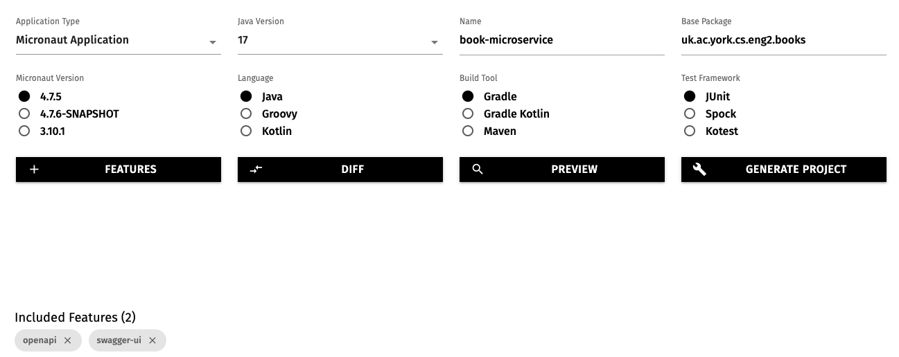
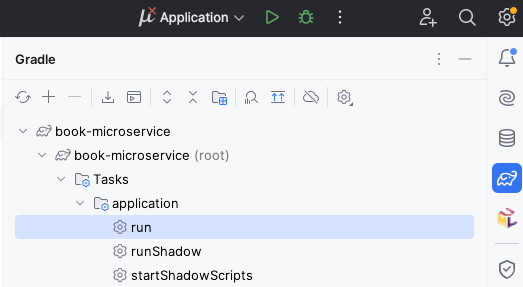
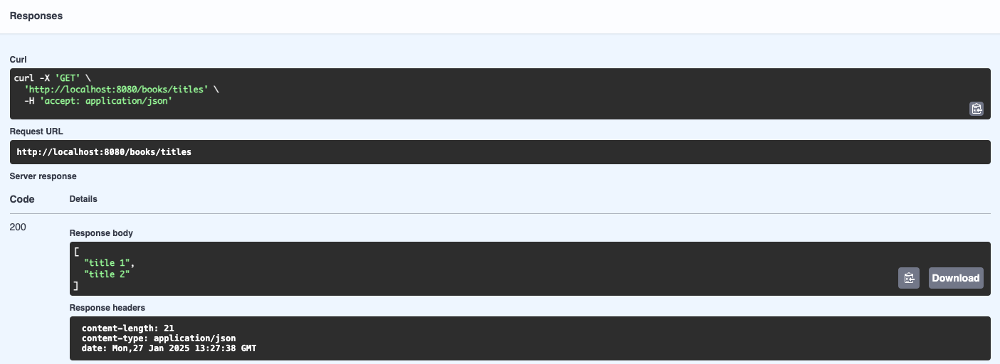

# Practical 1: Introduction to Micronaut

## Welcome

This is the worksheet for the first practical in the Engineering 2 module.
Work through every section of the practical in sequence, without missing steps.

### Introduction

In this practical, you will work through the basics of creating a microservice using [Micronaut](https://micronaut.io/).
The material needed for the lab can be found in these instructions.

### What you should already know

You should be able to:

* Create your own classes in the Java programming language.
* Be familiar with inheritance and implementing interfaces.
* Add [annotations](https://docs.oracle.com/javase/tutorial/java/annotations/) to classes, methods, parameters, and variables (e.g. `@Override` on a method).
* Use [generics](https://docs.oracle.com/javase/tutorial/java/generics/types.html) to parameterize types (e.g. `List<Integer>`).

If you need to read up on these concepts, consult the links in the Part 1 Java knowledge map in the VLE.

You should be familiar with these concepts from the lectures:

* The definition of software architecture as structure + -ilities + decisions + design principles.
* The microservices architectural pattern.
* The REST principles and the 4 levels of the Richardson Maturity Model.

### What you will learn

* How to create a new Micronaut project from scratch.
* How to import the project into IntelliJ.
* How to write controllers that handle HTTP requests in [JSON](https://www.json.org/) format.
* How to produce a web-based interface to try out the controllers.
* How to write unit tests for the controllers.

### What you will need

* Java 17 or newer: install from [Adoptium](https://adoptium.net/).
* An IDE with Gradle and Java support: in this worksheet, we discuss [IntelliJ IDEA](https://www.jetbrains.com/idea/).

### What you will do

You will implement and test a minimal version of a microservice which manages a collection of books.
The microservice will be able to create, retrieve, update, and delete books.

## Creating the Micronaut project

To create Micronaut projects, the fastest way is to use [Micronaut Launch](https://micronaut.io/launch/).

Open the above link in a new tab, and select these options:

* Application type: Micronaut Application
* Java version: 17
* Name: `book-microservice`
* Base package: `uk.ac.york.cs.eng2.lab1.books`
* Micronaut version: the latest non-SNAPSHOT 4.x version (4.7.4 as of writing)
* Language: Java
* Build tool: Gradle
* Test framework: JUnit

Click on the "Features" button, and add the `openapi` and `swagger-ui` features.
This will make Micronaut automatically produce a web-based user interface to try out our microservice.

The options will look like this:



Click on "Generate Project - Download Zip", and unzip the produced ZIP file into a folder named `book-microservice`.

## Importing the Micronaut project into IntelliJ

Open IntelliJ IDEA. If you have any projects open, close them with "File - Close Project".

Select the "Projects" section on the left, and click on the "Open" button on the top right.

Select the `book-microservice` folder (the one containing the `settings.gradle` file produced by Micronaut Launch).

You may get a dialog from IntelliJ asking if you can trust the project: select "Trust Project".

IntelliJ should now display your project, like this:


## Adding your first endpoint

Micronaut projects are intended to implement the microservices at the "back-end" of your application.
A Micronaut project is made up of multiple *controllers* which respond to the HTTP queries sent by clients.
A controller is a Java class annotated with `@Controller`, where the methods are annotated according to the HTTP method being used (e.g. `@Get`, `@Post`, or `@Put`).

Micronaut may have already generated a `BookMicroserviceController` class for us as an example: to avoid any confusion, delete it.
Instead, we will create our own controller from scratch: typically you have one controller per resource to manage (e.g. books).

First, create a `resources` subpackage within the main `uk.ac.york.cs.eng2.lab1.books` package, create a `BooksController` class in it, and annotate it with `@Controller("/books")`:

```java
package uk.ac.york.cs.eng2.lab1.books.resources;

import io.micronaut.http.annotation.Controller;

@Controller("/books")
public class BooksController {
}
```

Note how the `@Controller` annotation takes a parameter, which is the common prefix to all the URLs handled by this controller.
In this case, the controller will handle all the URls that start with `/books`.

We will then add a `@Get` method which will list the titles of the various books in our collection.
This is just to illustrate what it's like to work with Micronaut: we will change it later to use an internal in-memory list that is populated with our requests (which we will upgrade in later weeks to a relational database).

```java
@Get("/titles")
public List<String> getTitles() {
    return Arrays.asList("title 1", "title 2");
}
```

As you can see above, the `@Get` annotation also takes a string, which is the additional suffix that makes up the whole URL being handled.

With this minimal amount of code, we can already try out the project.
On the right side of IntelliJ, click on the Gradle icon (which looks like an elephant), find "Tasks - application - run", and double click on "run".
If you have trouble finding it, see the screenshot below:



After some time, you will see a line like this:

```
13:07:12.346 [main] INFO  io.micronaut.runtime.Micronaut - Startup completed in 249ms. Server Running: http://localhost:8080
```

This means that your Micronaut server is now ready to be tested.
To use the automatically generated web interface, visit [`http://localhost:8080/swagger-ui`](http://localhost:8080/swagger-ui).
You'll see an interface like this:


To try out your endpoint, expand the `GET /books/titles` element and click on the "Try it out" button.
You will then see an "Execute" button: click it to send the appropriate HTTP request.
It will look like this:



There are several parts here:

* The "Curl" section is a Unix terminal command that you can copy and paste to do the same HTTP request from outside a browser.
  In Windows, you can try this out from the "Git Bash" shell (Alt-right click on the desktop, and select Git Bash).
* The "Request URL" shows the full URL being targeted by our request: it combines the host and port, the `/books` part from the controller, and the `/titles` from the method.
* The "Server response" section shows we receive an HTTP 200 status code (which means "OK", i.e. successful response), and a JSON-formatted response with the two titles in our code. We can also read the various HTTP response headers that were produced by the server (length of the content in bytes, [MIME type](https://developer.mozilla.org/en-US/docs/Web/HTTP/MIME_types) of the content, and the timestamp of the response).

Stop the program from IntelliJ, as we will now make some changes.

## Sending Book objects

Rather than plain strings, we would like to send and receive all the information about a book in one go.
To do this, we will create a Data Transfer Object (DTO) class, which will be automatically turned to JSON by Micronaut so long as we annotate it as `@Serdeable` and follow certain conventions.

*Note*: the name `Serdeable` comes from "serialisable + deserialisable".
Serialisation is the process of turning an in-memory object into a stream of bytes that you can send over the network or save into a file (e.g. by representing it as JSON).
Deserialisation is the reverse process of reading a stream of bytes and turning it into an in-memory object.


## Adding the other endpoints

## Testing your endpoints

