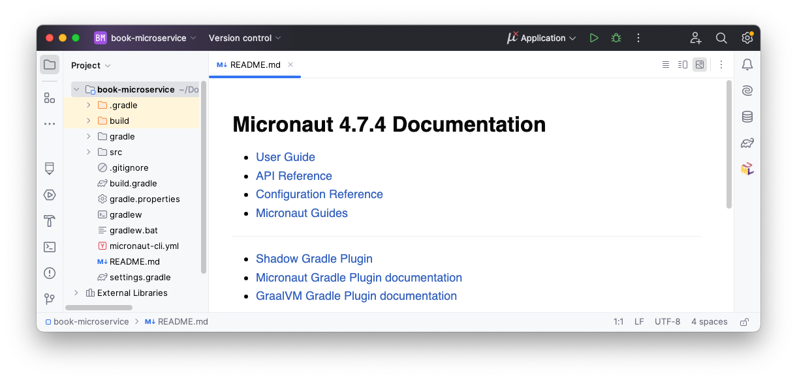

# Practical 1: Introduction to Micronaut

## Welcome

This is the worksheet for the first practical in the Engineering 2 module.
Work through every section of the practical in sequence, without missing steps.

### Introduction

In this practical, you will work through the basics of creating a microservice using [Micronaut](https://micronaut.io/).
The material needed for the lab can be found in these instructions.

### What you should already know

You should be able to:

* Create your own classes in the Java programming language.
* Be familiar with inheritance and implementing interfaces.
* Add [annotations](https://docs.oracle.com/javase/tutorial/java/annotations/) to classes, methods, parameters, and variables (e.g. `@Override` on a method).
* Use [generics](https://docs.oracle.com/javase/tutorial/java/generics/types.html) to parameterize types (e.g. `List<Integer>`).

For links to various resources that cover these aspects, consult the Part 1 Java knowledge map in the VLE.

### What you will learn

* How to create a new Micronaut project from scratch.
* How to import the project into IntelliJ.
* How to write controllers that handle HTTP requests in [JSON](https://www.json.org/) format.
* How to produce a web-based interface to try out the controllers.
* How to write unit tests for the controllers.

### What you will need

* Java 17 or newer: install from [Adoptium](https://adoptium.net/).
* An IDE with Gradle and Java support: in this worksheet, we discuss [IntelliJ IDEA](https://www.jetbrains.com/idea/).

### What you will do

You will implement and test a minimal version of a microservice which manages a collection of books.
The microservice will be able to create, retrieve, update, and delete books.

## Creating the Micronaut project

To create Micronaut projects, the fastest way is to use [Micronaut Launch](https://micronaut.io/launch/).

Open the above link in a new tab, and select these options:

* Application type: Micronaut Application
* Java version: 17
* Name: `book-microservice`
* Base package: `uk.ac.york.cs.eng2.lab1.books`
* Micronaut version: the latest non-SNAPSHOT 4.x version (4.7.4 as of writing)
* Language: Java
* Build tool: Gradle
* Test framework: JUnit

The options will look like this:

Click on "Generate Project - Download Zip", and unzip the produced ZIP file into a folder named `book-microservice`.

## Importing the Micronaut project into IntelliJ

Open IntelliJ IDEA. If you have any projects open, close them with "File - Close Project".

Select the "Projects" section on the left, and click on the "Open" button on the top right.

Select the `book-microservice` folder (the one containing the `settings.gradle` file produced by Micronaut Launch).

You may get a dialog from IntelliJ asking if you can trust the project: select "Trust Project".

IntelliJ should now display your project, like this:

## Adding your first endpoint

## Generating an OpenAPI-based client

## Adding the other endpoints

## Testing your endpoints

