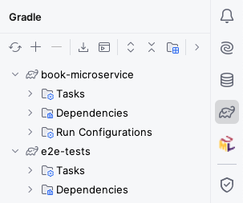

# End-to-end testing

If you remember from Practicals 3 and 4, we typically prefer testing components in isolation of each other, as these smaller tests are faster to run, easier to understand, and more reliable.

However, at some point we do need to have some tests that check that everything is working together: these are the *end-to-end tests*.

Since we already have thorough unit tests, we can keep end-to-end tests to the minimum needed to check that the various parts of our application can talk to each other.
In this section, you will create a separate Micronaut project which will use the OpenAPI specification of the microservice to automate a typical workflow in your application, and ensure things work as intended.

## Creating the end-to-end test project

End-to-end tests can span multiple microservices working together, which could be developed by different teams.
One common practice is to have these end-to-end tests in a separate project which all the teams involved can contribute to.

Additionally, in order to avoid depending on internal details that could change at any moment and break the tests, end-to-end testing is best done by focusing on the public interfaces of our microservices (our OpenAPI specifications).

Due to the above reasons, we will generate a separate Micronaut project which will only be used for end-to-end testing.
Use [Micronaut Launch](https://micronaut.io/launch/) as usual, but this time, do *not* add any features:

* Application type: Micronaut Application.
* Java version: 17.
* Name: `e2e-tests`.
* Base package: `uk.ac.york.cs.eng2.book.e2e`.
* Micronaut version: latest 4.x version.
* Language: Java.
* Build tool: Gradle.
* Test framework: JUnit.
* Features: do not select any features.

Download the project and import it to your IDE.
For this practical, you will need to have in your IDE both a solution to Practical 4 (either yours or the [model solution](../../solutions/practical3.zip)), and the end-to-end test project.

*NOTE*: in this practical we will not make *any* changes to `book-microservice` at all.
We will only develop `e2e-tests` and a Compose file that deploys `book-microservice`.

For loading multiple Gradle projects at the same time into IntelliJ, check how we did it in [Practical 3](../micronaut-kafka/02-create-project.md#adding-the-project-to-intellij).
Once you have loaded both, your Gradle drawer should look like this:



## Generating the OpenAPI client

Run `book-microservice`, download its OpenAPI specification from its Swagger UI into `src/main/openapi`, and configure the Gradle build of the `e2e-tets` project to produce a Micronaut declarative HTTP client from it.

You should be able to follow the same process as in [Practical 4](../service-integration/02-client-generation.md), adapting the `clientId`, package names, and file names accordingly.

### Getting HTTP responses from the generated client

If you need the generated client to have `HttpResponse<T>` return types (e.g. for accessing status codes or response headers), you may want to add this inside the `client` block:

```
alwaysUseGenerateHttpResponse = true
```

### Specifying the URL to the microservice under test

For the `application.properties` in `e2e-tests`, you will have to specify the URL to the `book-microservice`.
Assuming you used `books` for your `clientId`, it would look like this:

```
micronaut.http.services.books.url=http://localhost:8080
```

## Writing the end-to-end test

Having generated the client, you can now try writing test cases that cover the integration between the database, the Kafka cluster, and your microservice.
You do not need to exhaustively cover all the functionality: just focus on those aspects that your unit tests did not cover.

For example, our unit tests checked the OpenLibrary gateway, producers, and consumers in isolation, but not in combination.
We should do that from here.

Since we will need to make assertions about the *eventual* state of the system, you will need to add the [Awaitility](http://www.awaitility.org/) library to the Gradle build of `e2e-tests`.

Add this dependency to your `build.gradle` file, and reload all Gradle projects:
```groovy
testImplementation("org.awaitility:awaitility:4.3.0")
```

Create a `@MicronautTest` test class, and write a JUnit test case that does the following:

1. Create a book with an ISBN listed in [OpenLibrary](https://openlibrary.org/) (for example, [this one](https://openlibrary.org/books/OL26947056M/Minecraft)).
1. Assert that the response had the expected HTTP status code, and obtain the book ID from it.
1. Create an author.
1. Assert that the response had the expected HTTP status code, and obtain the author ID from it.
1. Use Awaitility to wait for up to 20 seconds for the publisher of the book to become the one listed in OpenLibrary.

Run the test and ensure it passes.
If it does not pass, you will have to double check your `book-microservice` (unless it's the model solution), and also this test.

Once the test passes, shut down `book-microservice` and move on to the next section.

### Refresher on Awaitility assertions

Remember that the basic syntax of an Awaitility test assertion is something like this:

```java
await().atMost(Duration.ofSeconds(SECONDS)).until(callable_of_expectation);
```

In the above code:

* `SECONDS` is the number of seconds you want to wait for.
* `callable_of_expectation` is a `Callable<Boolean>` object which encodes your expectation as to what should be the eventual state of the system (in this case, that asking for the publisher of the book would give you the expected result). It's common to instantiate such a `Callable<Boolean>` through [lambda expressions](https://dev.java/learn/lambdas/first-lambdas/) (which we discussed in the Week 3 lectures).

### Re-running the end-to-end test from a clean slate

Keep in mind that this test assumes we start from a clean database and a clean Kafka cluster.
If you need to re-run this test, it's best to start from an empty slate by stopping your Micronaut Test Resources server and waiting for its Docker containers to be shut down.
You can do this by following these steps:

1. Shut down the `book-microservice`.
1. Run the `stopTestResourcesServer` Gradle task inside `book-microservice`.
1. Open Docker Desktop and wait for the Test Resources, MariaDB, and Kafka containers to shut down and disappear.
1. Start the `book-microservice` again and wait for it to fully start.
1. You can now re-run your end-to-end test.
