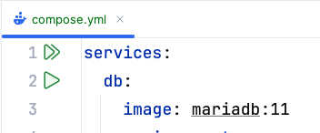
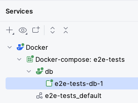

# Writing and testing the Compose spec

We have developed the `book-microservice` and we now want to deploy it to production.

In a production environment, we obviously want to retain data indefinitely, unlike Micronaut Test Resources where data is automatically lost once we shut down the Test Resources server.
We will also want to configure the database and the Kafka cluster more carefully, and use a multi-node Kafka cluster instead of a single-node one, for horizontal scaling of throughput and storage capacity, and improved durability via replication.

We will approximate such a production environment by repackaging our application as an orchestration of multiple Docker containers, configured to talk with each other in a private network, with only the strictly necessary endpoints exposed to the outside.

## Building the Docker image

We will need to build the Docker image for `book-microservice`.

To do so, run the `dockerBuild` Gradle task in the `build` group.

After some time, if all has gone well, you will see a message like this:

```
Successfully tagged book-microservice:latest
```

This means that your local Docker installation now has a `book-microservice` image, with the `latest` tag.

In a real-world environment you would normally push this image to a registry (e.g. Docker Hub, Github Packages, or your company's), but in ENG2 we will limit ourselves to local images.

## Starting the Compose file: initial skeleotn

Create a `compose.yml` file inside the root directory of `e2e-tests` (the same one that has the `build.gradle` file).

Let's start with the most basic skeleton, with just two keys at the top level:

```yaml
services:
volumes:
```

These are the two main keys of a Compose file.
Note that the full documentation for the Compose file format is [available online](https://docs.docker.com/reference/compose-file/): it was originally specific to Docker Compose, but it has since evolved into an independent spec used by multiple tools (similarly to how OpenAPI specifications were previously specific to Swagger).

A Compose file is written in YAML: you may also want to read the [official overview](https://yaml.org/spec/1.2.2/#chapter-2-language-overview) if you are not familiar with YAML.

The `services` key is a map that contains one key for each service that we want to deploy, and `volumes` is a map that contains one key for each persistent volume we want to use from our containers.

## Adding the MariaDB database server

For our first service, we will add a `db` key inside the `services` to run a MariaDB container, using [the official image](https://hub.docker.com/_/mariadb).
Looking at their instructions, we figure out that we want to update our Compose file to look like this:

```yaml
services:
  db:
    image: mariadb:12
    environment:
      MARIADB_USER: books
      MARIADB_PASSWORD: bookspw
      MARIADB_ROOT_PASSWORD: iamroot
      MARIADB_DATABASE: booksdb
    volumes:
      - mariadb_data:/var/lib/mysql
    healthcheck:
      test: ['CMD', 'healthcheck.sh', '--su=mysql', '--connect', '--innodb_initialized']
      timeout: 10s
      retries: 3
volumes:
  mariadb_data:
```

The above fragment means the following:

* The `db` service runs the MariaDB 12 image from the Docker Hub.
* The `db` service mounts the `mariadb_data` named volume into `/var/lib/mysql` so the database can survive the re-creation of the container, as suggested in the image documentation (see "Where to Store Data").
* The `db` service sets a few environment variables that are used by the image to set the username and password for the default database, as well as the password of the root MariaDB user.
* The `db` service includes an automated healthcheck (based on the image instructions). This is used in two ways:
  * To detect when the database server has fully started and is ready for connections.
  * To monitor the ongoing health of the service in case it goes down.

## Running the Compose file from IntelliJ

You can try this Compose file now.
If you are using IntelliJ IDEA with its Docker support, you will see an icon with two green triangles next to the `services:` line, like this:



Clicking that button is equivalent to running `docker compose up` from a Git Bash console.
The `up` command tells Compose to update the set of running containers based on the current contents of the Compose file, recreating them as needed.

After clicking that button, IntelliJ will display a "Services" drawer with the current status of the Docker Compose project:



After some time, you should see the `db` service become `healthy` inside the Services tab: this means the server is working correctly.

The "Services" drawer has "Restart", "Stop", and "Down" buttons which are all equivalent to these commands:

* Restart: `docker compose restart`, restarts all services.
* Stop: `docker compose stop`, stops all services but does not delete their containers.
* Down: `docker compose down`, stops all services and deletes the containers (but not their volumes).

The "Services" drawer has a "Volumes" item as well that lists all the volumes.
You should be able to see the `e2e-tests_mariadb_data` volume that will store the MariaDB database.

You should also be able to see the `e2e-tests_default` virtual network that has been created for this Compose project:


The above screenshot shows how the `db` service is bound to the 172.19.0.2/16 IP address.
If you wanted to connect to it directly, you would have to use that IP address.
Alternatively, you can map some of its ports to be accessible from other machines in your network and from your `127.0.0.1` (aka `localhost`) IP address: we'll do that later for our microservice.

## Adding the Kafka cluster

The next part is to add a multi-node Kafka cluster: specifically, in this practical we will add a 3-node cluster.

The configuration of Kafka is quite involved, but for this module we will just ask you to reuse [the configuration we use for the `todo-microservice`](https://github.com/uoy-cs-eng2/todo-microservice/blob/main/compose-it.yaml).

Specifically, you should copy over the configurations for:

* The `kafka-0`, `kafka-1`, and `kafka-2` services.
* The `kafka_0_data`, `kafka_1_data`, and `kafka_2_data` volumes.

You could also copy over the configuration for the `kafka-ui`, if you would like to have a user-friendly UI to inspect your Kafka topics.
Note that administrative user interfaces like `kafka-ui` would need to be adequately secured in a production environment.

If you look closely at these configurations, you'll notice that we have set up automated healthchecks for each Kafka node as well.

Click again on the "Run All" button at the top of the `compose.yml` file (or run `docker compose up -d` from the same directory as the `compose.yml` file in a Git Bash console), and after some time you should see all three Kafka nodes running, with `healthy` next to `kafka-0`.


If you copied over the `kafka-ui` service, you should also be able to [access it via your browser](http://localhost:9001).

Here are some details of how we have configured this cluster.
If you would like to know more, read on, otherwise go to the next step:

* We use the [Apache Kafka image](https://hub.docker.com/r/apache/kafka), which is based from its open-source release without any Confluent extras. 
* We choose 3 nodes as that is the minimal number we need in order to reach consensus (2 nodes would run into ties).
  The overall multi-node setup is as follows:
  * Each node has a unique ID (`KAFKA_NODE_ID`) within the cluster.
  * Kafka nodes can have different roles (controller, broker), but here we have all 3 nodes take on both roles (`KAFKA_PROCESS_ROLES`).
  * Nodes need to know about each other for voting processes (`KAFKA_CONTROLLER_QUORUM_VOTERS`).
* Each node has a number of "listeners" that accept connections, with different roles:
  * Within the Compose network, regular users (like our microservice) will use the `PLAINTEXT` listeners which listen on port 9092.
  * Controllers will talk to each other via the `CONTROLLER` listeners bound to port 9093.
  * Only the `PLAINTEXT` listener is advertised to regular users (`KAFKA_ADVERTISED_LISTENERS`).
  * We use plaintext security for both listeners (`KAFKA_LISTENER_SECURITY_PROTOCOL_MAP`): in a production environment we will use stronger security.
  * We use `KAFKA_CONTROLLER_LISTENER_NAMES` and `KAFKA_INTER_BROKER_LISTENER_NAME` to indicate the listeners used for inter-controller and inter-broker communication.
* We have some default topic settings: 6 partitions (`KAFKA_NUM_PARTITIONS`), 3 replicas (`KAFKA_OFFSETS_TOPIC_REPLICATION_FACTOR`, `KAFKA_TRANSACTION_STATE_LOG_REPLICATION_FACTOR`), and a minimum of 2 replicas must confirm each write when producing events (`KAFKA_TRANSACTION_STATE_LOG_MIN_ISR`).
  * The settings in our `NewTopic` instances take precedence over these, however.
* We have disabled topic autocreation (`KAFKA_AUTO_CREATE_TOPICS_ENABLE`): instead, we use our topic factories. This prevents unintentional creation of topics.
* `JMX_PORT` enables the [Java Management Extensions](https://docs.oracle.com/javase/8/docs/technotes/guides/management/agent.html) instrumentation to automatically obtain certain metrics, such as memory usage.
  * In this module, we will not secure it to keep things simple, but this must be done for a production environment.

## Adding the microservice

With a working MariaDB database and Kafka cluster, we are ready to add our microservice.
Add this service to your `compose.yml` file:

```yaml
books:
  image: book-microservice:latest
  ports:
    - 8080:8080
  environment:
    DATASOURCES_DEFAULT_URL: jdbc:mariadb://db/booksdb
    DATASOURCES_DEFAULT_USERNAME: books
    DATASOURCES_DEFAULT_PASSWORD: bookspw
    KAFKA_BOOTSTRAP_SERVERS: kafka-0:9092,kafka-1:9092,kafka-2:9092
  depends_on:
    db:
      condition: service_healthy
    kafka-0:
      condition: service_healthy
```

This service uses the image we built before, and has some settings of its own:

* The `ports` key tells Docker to expose the 8080 port of the container from the host machine.
  * This means that you'll be able to use [`http://localhost:8080`](http://localhost:8080) from your browser to connect to the container, without having to use the internal Docker network IP.
  * It also means that other machines in your network will be able to access it, so long as they know your IP address.
* The environment variables point to our database server and Kafka cluster:
  * `DATASOURCES_DEFAULT_URL` is equivalent to setting `datasources.default.url` in our `application.properties`.
    It is set to the JDBC URL used to connect to the database, which follows the format `jdbc:DRIVER://HOST/DB_NAME`.
    We use the `mariadb` JDBC driver, connect to the MariaDB server at `db` (its hostname is set to its key within `services`), and use the `booksdb` schema in it.
  * `DATASOURCES_DEFAULT_USERNAME` and `DATASOURCES_DEFAULT_PASSWORD` match what we used for the username and password in the `db` service.
  * `KAFKA_BOOTSTRAP_SERVERS` is equivalent to setting `kafka.bootstrap.servers` in our `application.properties`.
    It is a comma-separated list of the Kafka brokers that the microservice should connect to, which matches the `PLAINTEXT` listeners we set up to listen on port 9092 of each Kafka node.
    Note again how the hostnames match the service names of the Compose file.
* We use `depends_on` to indicate that this service should only be started after `db` and `kafka-0` have started.
  In fact, we go even further and wait for them to be healthy, by using the `condition: service_healthy` option.

Save your `compose.yml` file and click on the "Run All" button next to its `services:` line.
After some time, you should see the `books` service running as well (with a green icon):


Try using your microservice from the browser, using [Swagger UI](http://localhost:8080/swagger-ui#/).
It should work as normal.

## Re-running the end-to-end tests on the containerised version

We have a production-like deployment now, with a multi-node Kafka cluster and a database that will persist across container upgrades.
It's time to see if this containerised version also passes our end-to-end tests.

Since we have not changed our end-to-end tests, we will have to clean the cached tests results first by running the `clean` Gradle task.

Once that is done, run the `test` Gradle task: since your container is exposed from the same URL as before (`http://localhost:8080`), the test should pass without requiring any changes.

If at some point you need to re-run the tests from a clean database and Kafka cluster, you can follow these steps:

1. Use the "Down" button to destroy the containers.
1. Go to the "Volumes" section in the "Services" drawer (or in Docker Desktop) and delete all volumes.
1. Run your Compose file again and wait for all services to start.
1. Re-run your tests by running the `clean` and `test` Gradle tasks in the `e2e-tests` project.

## End of the practical

Congratulations, you have now containerised your Micronaut microservice!

If you were happy with a single-node deployment, you could take this Compose file as a starting point for your deployment.
You would need to add authentication and authorisation as needed, and create a front-end on top of the microservice, of course: these are topics outside this module.