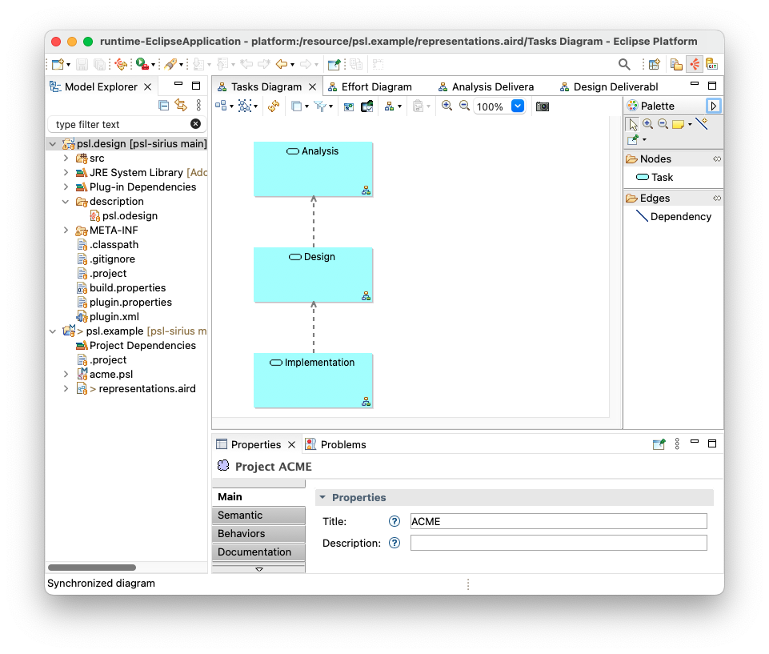
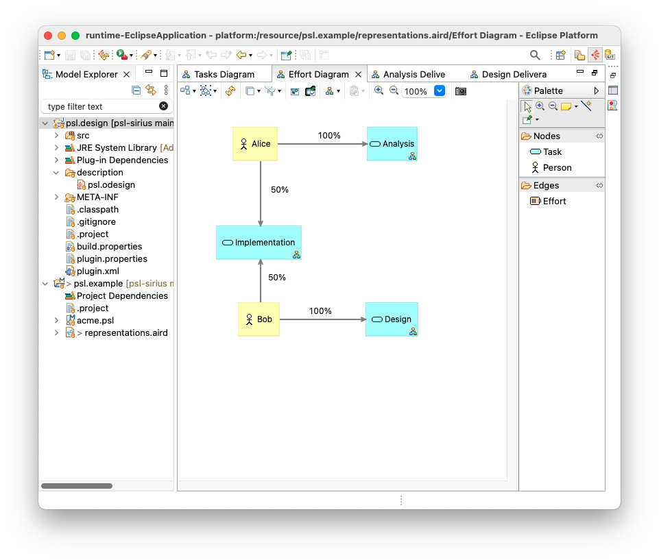
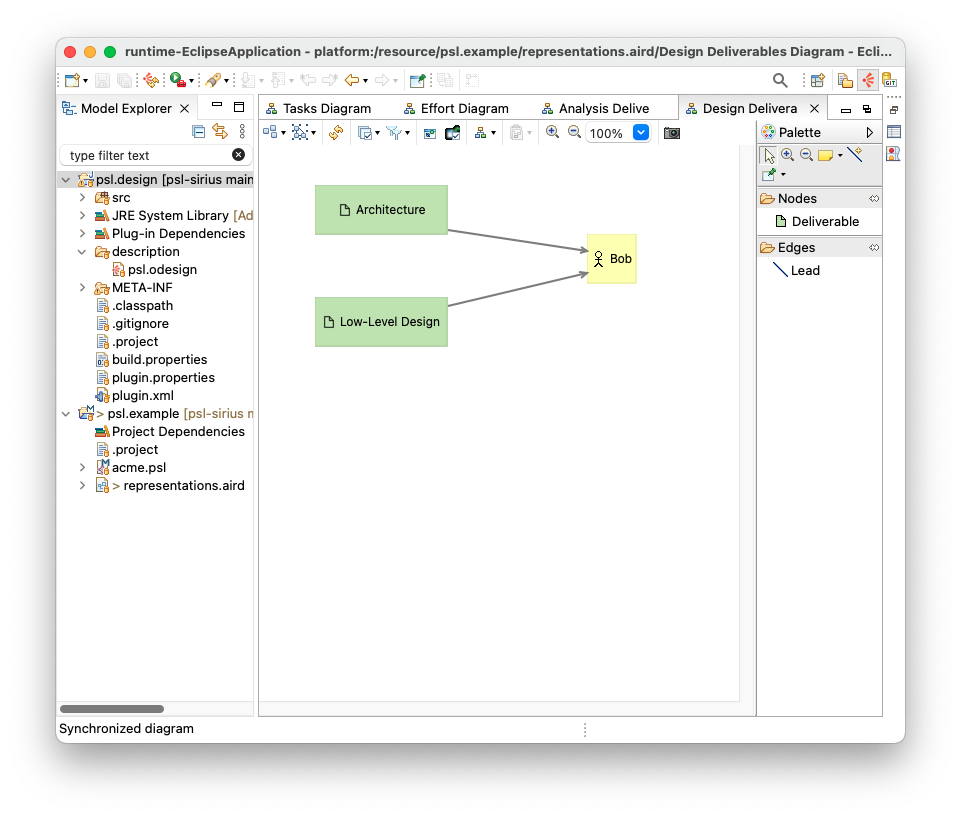
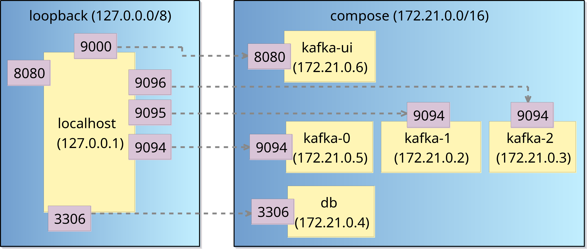
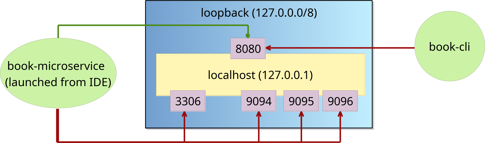

# Sirius-based notation

- Create a generic Eclipse project with the Emfatic metamodel
    - Name the project after your metamodel (e.g. if the filename of your metamodel is `sdl.emf`, name the project `sdl`)
- Generate the `.ecore` file from the Emfatic metamodel, and use it to generate the `model`, `edit`, and `editor` plugins
    - For detailed steps, check the recording of the second lecture of Week 6 ("The Eclipse Modeling Framework")
- Define a Sirius graphical editor following the steps in the Sirius lectures on Week 7
- Run a nested Eclipse instance
    - Right-click on your project and select `Run as -> Eclipse Application`
- Create a model using your Sirius-based editor in the nested workspace

## Example editors

Below are two Sirius-based editors from which you can draw inspiration.

### Project Scheduling Language

GitHub repository: [https://github.com/uoy-cs-eng2/psl-sirius](https://github.com/uoy-cs-eng2/psl-sirius)

### Docker Network Language

GitHub repository: [https://github.com/uoy-cs-eng2/docker-network-diagrams](https://github.com/uoy-cs-eng2/docker-network-diagrams)

## Sirius documentation

- [Getting Started with Sirius](https://eclipse.dev/sirius/getstarted.html)
- [Sirius documentation](https://eclipse.dev/sirius/doc/)
- [BasicFamily tutorial](https://wiki.eclipse.org/Sirius/Tutorials/BasicFamily)

For additional resources, please check the links at the end of the Sirius lecture
