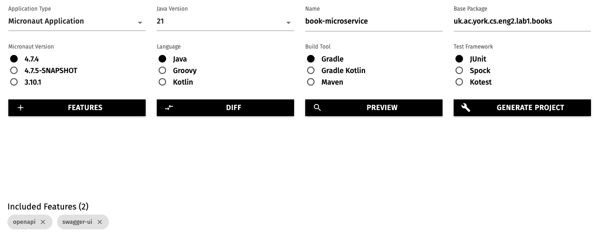

# Starting your first project

## Creating the project

To create Micronaut projects, the fastest way is to use [Micronaut Launch](https://micronaut.io/launch/).

Open the above link in a new tab, and select these options:

* Application type: Micronaut Application
* Java version: 17
* Name: `book-microservice`
* Base package: `uk.ac.york.cs.eng2.books`
* Micronaut version: the latest non-SNAPSHOT 4.x version (4.7.4 as of writing)
* Language: Java
* Build tool: Gradle
* Test framework: JUnit

Click on the "Features" button, and add the `openapi` and `swagger-ui` features.
This will make Micronaut automatically produce a web-based user interface to try out our microservice.

The options will look like this:

Click on "Generate Project - Download Zip", and unzip the produced ZIP file into a folder named `book-microservice`.

## Importing the Micronaut project into IntelliJ

Open IntelliJ IDEA. If you have any projects open, close them with "File - Close Project".

Select the "Projects" section on the left, and click on the "Open" button on the top right.

Select the `book-microservice` folder (the one containing the `settings.gradle` file produced by Micronaut Launch).

You may get a dialog from IntelliJ asking if you can trust the project: select "Trust Project".

IntelliJ should now display your project, like this:

