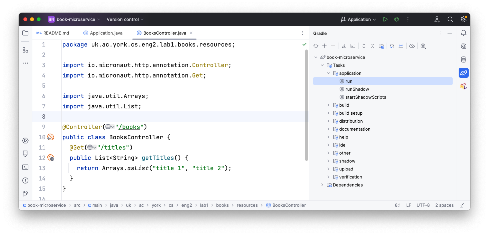
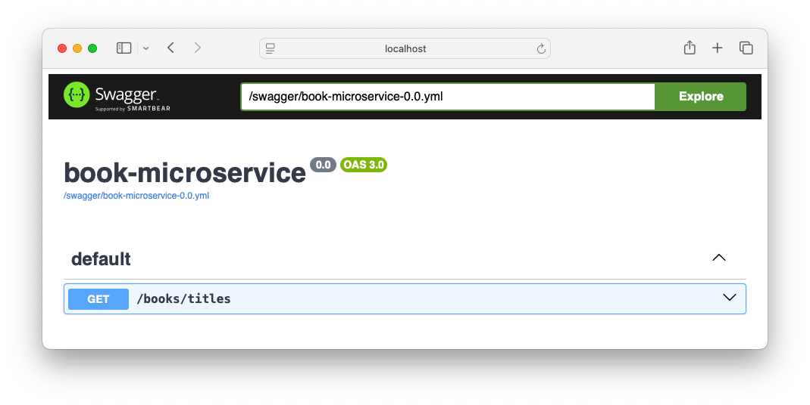
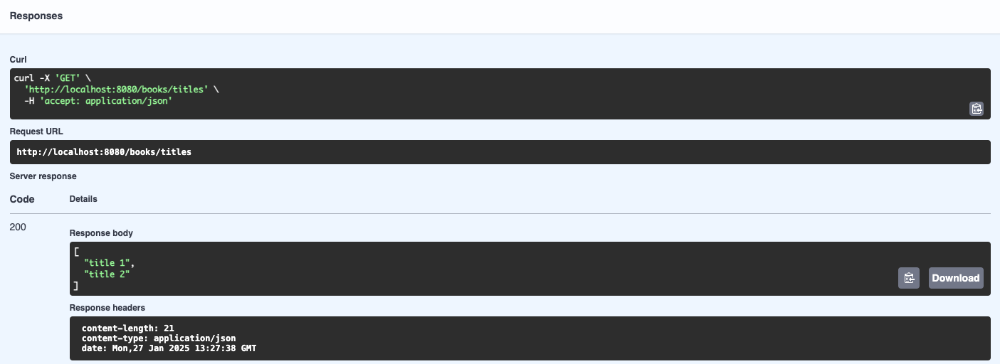

# Adding your first endpoint

Micronaut projects are intended to implement the microservices at the "back-end" of your application.
A Micronaut project is made up of multiple *controllers* which respond to the HTTP queries sent by clients.
A controller is a Java class annotated with `@Controller`, where the methods are annotated according to the HTTP method being used (e.g. `@Get`, `@Post`, or `@Put`).

Micronaut may have already generated a `BookMicroserviceController` class for us as an example: to avoid any confusion, delete it.
Instead, we will create our own controller from scratch: typically you have one controller per resource to manage (e.g. books).

## Writing the controller

First, create a `resources` subpackage within the main `uk.ac.york.cs.eng2.lab1.books` package, create a `BooksController` class in it, and annotate it with `@Controller("/books")`:

```java
package uk.ac.york.cs.eng2.lab1.books.resources;

import io.micronaut.http.annotation.Controller;

@Controller("/books")
public class BooksController {
}
```

Note how the `@Controller` annotation takes a parameter, which is the common prefix to all the URLs handled by this controller.
In this case, the controller will handle all the URLs that start with `/books`.

We will then add a `@Get` method which will list the titles of the various books in our collection.
This is just to illustrate what it's like to work with Micronaut: we will change it later to use an internal in-memory list that is populated with our requests (which we will upgrade in later weeks to a relational database).

```java
@Get("/titles")
public List<String> getTitles() {
    return Arrays.asList("title 1", "title 2");
}
```

As you can see above, the `@Get` annotation also takes a string, which is the additional suffix that makes up the whole URL being handled.

## Trying out the controller via Swagger UI

With this minimal amount of code, we can already try out the project.
On the right side of IntelliJ, click on the Gradle icon (which looks like an elephant), find "Tasks - application - run", and double click on "run".
If you have trouble finding it, see the screenshot below:



After some time, you will see a line like this:

```
13:07:12.346 [main] INFO  io.micronaut.runtime.Micronaut - Startup completed in 249ms. Server Running: http://localhost:8080
```

This means that your Micronaut server is now ready to be tested.
To use the automatically generated web interface, visit [`http://localhost:8080/swagger-ui`](http://localhost:8080/swagger-ui).
You'll see an interface like this:



To try out your endpoint, expand the `GET /books/titles` element and click on the "Try it out" button.
You will then see an "Execute" button: click it to send the appropriate HTTP request.
It will look like this:



There are several parts here:

* The "Curl" section is a Unix terminal command that you can copy and paste to do the same HTTP request from outside a browser.
  In Windows, you can try this out from the "Git Bash" shell (Alt-right click on the desktop, and select Git Bash).
* The "Request URL" shows the full URL being targeted by our request: it combines the host and port, the `/books` part from the controller, and the `/titles` from the method.
* The "Server response" section shows we receive an HTTP 200 status code (which means "OK", i.e. successful response), and a JSON-formatted response with the two titles in our code. We can also read the various HTTP response headers that were produced by the server (length of the content in bytes, [MIME type](https://developer.mozilla.org/en-US/docs/Web/HTTP/MIME_types) of the content, and the timestamp of the response).

Stop the program from IntelliJ, as we will now make some changes.
