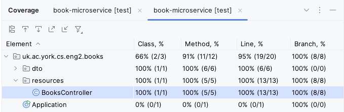

# Automated testing

Instead of trying out all our endpoints manually after every change, we'd like to have automated tests that they work as intended.
Micronaut has specific facilities for helping with tests, while emulating real HTTP requests.

## Creating the declarative HTTP client

In order to test all the steps that real requests would go through, our tests will send HTTP requests to our application, instead of directly calling the methods of the controller.
To simplify that task, we will use the [declarative HTTP client support](https://docs.micronaut.io/4.7.11/guide/#clientAnnotation) in Micronaut.

Within the `test` folder (which should have all the code for our tests, so we do not unnecessarily bundle it with a regular release), create a `resources` subpackage within `uk.ac.york.cs.eng2.books`.

Create a `BooksClient` interface in this same package.

Your project should now look like this:


The interface should be annotated with `@Client` (using the same URL prefix as our `@Controller`), and have all the public methods of the `BooksController`, without their bodies.
It should look like this:

```java
@Client("/books")
public interface BooksClient {
  @Get
  List<Book> getBooks();

  @Post
  void createBook(@Body Book book);

  // ... rest of the public methods in your controller ...
}
```

Micronaut will automatically generate the code for the HTTP client based on this interface and its annotations.

## Writing the first test

Since we will be testing the `BooksController` class, we will create a `BooksControllerTest` class in the same package as above.

Micronaut applications normally launch through the `Application` class that Micronaut Launch generated for you, as there is a certain process involved in their startup.
We need this startup process to happen before each of our tests as well.
To do this, add the `@MicronautTest` annotation to your test class, like this:

```java
@MicronautTest
public class BooksControllerTest {
}
```

For your tests, you will need the declarative HTTP client generated by Micronaut.
Instead of creating the instance yourself, you should ask Micronaut to provide it to your tests by adding this inside your class:

```java
@Inject
private BooksClient booksClient;
```

`@Inject` is one of several standard annotations for dependency injection: these are originally from the [JSR-330 specification](https://jcp.org/en/jsr/detail?id=330) (starting with `javax.inject`), which were later renamed to `jakarta.inject`.
Micronaut supports a wide range of dependency injection mechanisms: here we use the simplest form of [field injection](https://docs.micronaut.io/4.7.11/guide/#fieldInjection).

Let's add the most basic test one could imagine: if we ask for the list of books without having added anything yet, we should get the empty list.
It would look like this:

```java
@Test
public void noBooks() {
  assertEquals(0, booksClient.getBooks().size());
}
```

*Note*: you may need to add `import static org.junit.jupiter.api.Assertions.*;` in order to have access to `assertEquals` and other JUnit assertions.

IntelliJ should recognise the class as a test class, and you should see an icon to the left of the `public class BooksControllerTest` line that you can click to run all the tests in the class.
This icon may change depending on the success or failure of your tests.
For instance, it looks like this after all tests have passed:


You can also run all the tests in your project by running the Gradle `test` task:


Your test should pass, and we can move on to the rest of the tests.

## Measuring code coverage

Obviously, there is still much to test.
We should aim to have tests that cover all the important situations in our code.
One way to find out what we are missing is to perform "coverage analysis": you can do this from IntelliJ by right-clicking on the Gradle "test" task and selecting "Run with Coverage".

You will get a report like this:


Here we have only covered 20% of the methods in the `BooksController`.
The lines we have missed are colored in red on the left: we have only covered `getBooks()` with our single test.
You may also see lines covered in yellow: this means that we only covered some of its branches (e.g. we only covered the `if` branch and not the `else` branch).

## Adding the second test

Try adding a test which creates a book (via `booksClient.createBook`) and then gets all the books (via `booksClient.getBooks`).

If you run your tests again, you may notice that one of the two tests will fail.
This is because Micronaut is reusing the same `BooksController` object across tests, with the same underlying map from IDs to `Book`s, so one test may interfere with the other.
To avoid this, change the `@MicronautTest` annotation to this:

```java
@MicronautTest(rebuildContext = true)
public class BooksControllerTest {
    // ... leave code as is ...
}
```

The `rebuildContext = true` option will make Micronaut recreate the controller for each test, so each test will start from a clean map from IDs to `Book`s.
In a normal application, we would use a database instead of a Java map, and instead of `rebuildContext = true` we would have a `@Before` test setup method that would clean the database between tests: we will learn how do to it in later labs.

## More tests for creating and updating books

Write test methods for each of these scenarios, and ensure they pass:

* Create a book, and then check that it can be retrieved by ID.
* Retrieve a book that doesn't exist (assert that `getBook(...)` returns `null`).
* Create a book, and then update only its title.
* Create a book, and then update only its author.
* Create a book, and then delete it.

## Testing deletion and updating of missing books

We still need to write test methods for these scenarios:

* Update a book that doesn't exist.
* Delete a book that doesn't exist.

However, there is a slight complication: 404 errors [are not rethrown as exceptions from the Micronaut declarative client](https://docs.micronaut.io/4.7.11/guide/#clientError).
We were able to test the scenario where we try to fetch a missing book by asserting that the declarative client returned `null` instead of a `Book` object, but our `updateBook` and `deleteBook` methods simply return `void`, so we do not have anything to check in a JUnit assertion.

Go to the `BooksClient` declarative HTTP client interface, and change the return type of `updateBook` and `deleteBook` to `HttpResponse`.
Micronaut will then return the raw HTTP response, which will include the HTTP status code.
This will allow you to assert that an HTTP 404 Not Found response was produced with:

```java
HttpResponse response = booksClient.updateBook(update, 23);
assertEquals(HttpStatus.NOT_FOUND, response.getStatus());
```

You should be able to write those two tests now.
If you have written all your tests correctly, all the lines in `BooksController` should be highlighted in green, and you should be able to see 100% line, branch, and method coverage for that class:

