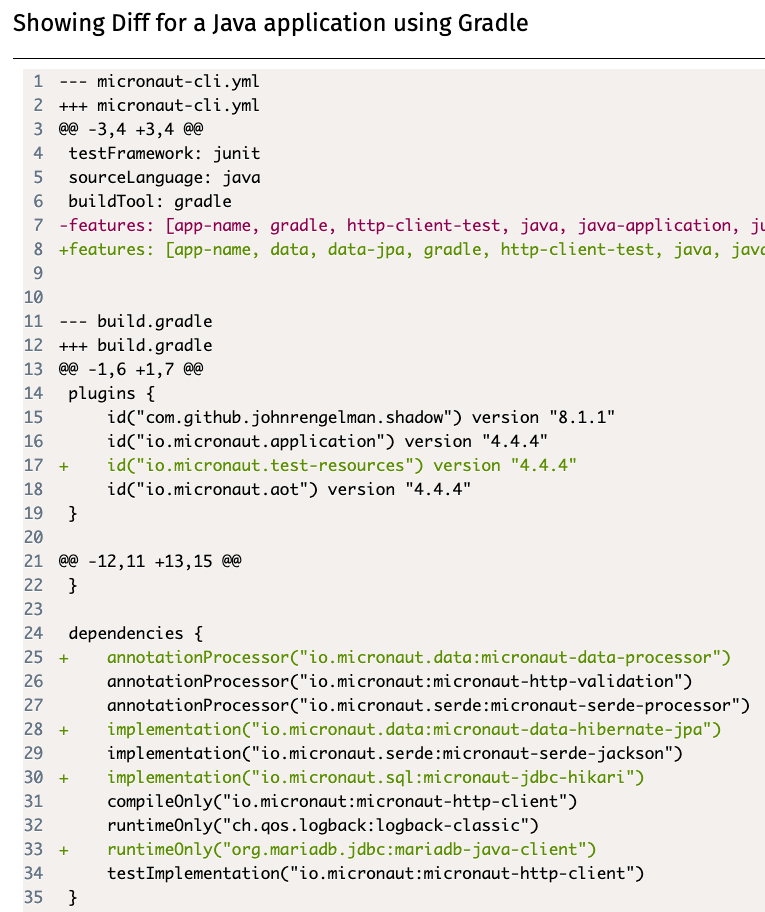

# Adding libraries

Before starting this section, you will need to have a solution to Practical 1.
You can use your own, or you can start from the model solution in the VLE.

## What we need

We need to add a few things to our project from Practical 1:

* A JDBC driver: in this course we will connect to MariaDB databases.
* A connection pooling library: we will use HikariCP.
* A database migration framework: we will use Flyway.
* A database access toolkit: we will use Micronaut Data JPA.
  * Micronaut Data JPA internally uses the [Hibernate](https://hibernate.org/) ORM.

Micronaut projects typically follow a modular structure, where you can add a number of *features* to it with support for various technologies.
You already did this in Practical 1, by picking the features for OpenAPI generation and the Swagger UI.
We will do the same here, but instead of creating a new project, we will be extending our existing project.

## Updating our project

The easiest way to find out the changes we have to make in our project is to use [Micronaut Launch](https://micronaut.io/launch/).
Instead of generating a new project, we will instead produce a `diff` which will indicate the changes that we should make.

Open Micronaut Launch.
Ensure the settings match those you used in Practical 1 (Java Version, Name, Base Package, Build Tool, and so on).
Click on "Features" and select these elements:

* `mariadb`: the JDBC driver for MariaDB.
* `jdbc-hikari`: the connection pooling library.
* `flyway`: the database migration framework.
* `data-jpa`: the Micronaut Data library in its JPA flavour.

Click on "Diff", and it will produce a patch in the [unidiff format](https://en.wikipedia.org/wiki/Diff#Unified_format) with the changes that would have to be made, like this one:

Unfortunately, this patch will often not be directly usable via automated tools (as we will have made customisations from the initially generated project), so we will have to make its changes manually.
Here is a quick summary of the notation:

* `--- OLD_FILE` and `+++ NEW_FILE` refer to the old and new locations of a file.
  `OLD_FILE` and `NEW_FILE` may be the same if the file has not been moved.
* `@@ -oldL, oldS +newL, newS@@` start a `hunk` describing a change in the file.
  The hunk refers to the lines from `oldL` to `oldL+oldS` in the old file, and to the lines from `newL` to `newL+newS` in the new file.
* Lines starting with `-` are the old lines to be removed.
* Lines starting with `+` are the new lines to be added.
* Lines starting with a space are just context to help understand the change.

If you read through the changes, you will see that you have to do the following:

* Add a few `features` to the list in `micronaut-cli.yml`, which match the ones you selected in Micronaut Launch.
* Add the `io.micronaut.test-resources` plugin to the list in your `build.gradle` file.
* Add the listed dependencies to the `dependencies` block in your `build.gradle` file.
* Optionally, add some text to your `README.md` file with some useful links to the relevant documentation.
* Create a new `src/test/resources/application-test.properties` file with some content within your project.
* Add a few lines to your `src/main/resources/application.properties` file.

When copying and pasting the new lines, remember to remove the initial `+` as that is just for indicating that it's new text.

## What do these changes mean?

The changes in the `micronaut-cli.yml` file are for integration with the [Micronaut CLI](https://docs.micronaut.io/latest/guide/#cli), which we do not use in this module.

The changes in the `build.gradle` file make some important additions:

* They add the [Micronaut Test Resources](https://micronaut-projects.github.io/micronaut-test-resources/latest/guide/) plugin to our Gradle build, which will use our local installation of Docker Desktop to automatically start anything we need for local development and testing (namely, MariaDB and later Kafka).
*  They add the various Java libraries required to use Micronaut Data JPA with a MariaDB database.

As said above, the `README.md` changes are just some useful links that you can check while doing this practical.

The `application-test.properties` changes tell Hibernate that it should not try to automatically create tables in our database from our JPA-annotated classes, by setting the `hbm2ddl.auto` option to `none`. (`hbm` refers to Hibernate, and `ddl` refers to SQL Data Definition Language queries like `CREATE TABLE`.)

The `application.properties` changes do a few things:

* They indicate that the `default` data source is a MariaDB database, using the `MYSQL` dialect of SQL (used for the underlying JDBC connection), and specifying the fully-qualified class name of the MariaDB JDBC driver.
* They turn on [Micronaut Flyway](https://micronaut-projects.github.io/micronaut-flyway/latest/guide/) for the `default` data source, so it will automatically apply all pending database migrations on startup.
* Since we're using Flyway, they also disable `hbm2ddl` here.

## Ready to move on?

Once you've made all the changes in the patch produced by Micronaut Launch, we can continue.

Do not try to run the project yet, as we still have some changes to make.
