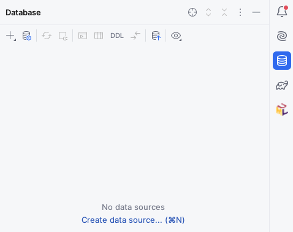
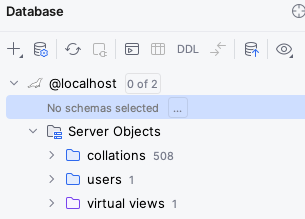
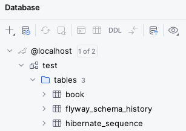

# Book entity

Let's migrate our in-memory `Book`s to database records.
We will create the first migration for our database, write the JPA entity, and migrate our codebase to use it.

## Creating the database migration

We are using Micronaut Flyway to maintain our database schema over multiple releases of the microservice.
In this first release, we will create the `hibernate_sequence` sequence needed by Hibernate to compute primary keys for new objects, and the `book` table needed to store books.

In IntelliJ, create the `src/main/resources/db/migration/V1__create-book.sql` file.
The `V1` is used to indicate that this is the first migration to be run, and then we have two underscores to separate the version number from the short description of the migration.

The file should have this content:

```sql
create sequence hibernate_sequence;

create table book (
  id bigint primary key not null,
  title varchar(255) not null,
  author varchar(255) not null
);
```

## Renaming the Book DTO class

We will be creating a `Book` domain class soon, so to avoid confusion we should rename our existing `Book` Data Transfer Object (DTO) class to `BookDTO`.
From now on, we will follow the convention of adding `DTO` at the end of the name of every DTO class.

You can do this by right-clicking on `Book` within the `Project` section of IntelliJ, selecting "Refactor - Rename" and entering `BookDTO`.
Do not rename similarly named fields or classes.

## Creating the Book domain entity

We now need to create a JPA `@Entity` class that matches the `book` table.
Create a new `domain` subpackage within `uk.ac.york.cs.eng2.books`, and create a `Book` class within it.

If you remember from the lecture, mapping the `book` table to a JPA entity would require these steps:

* Annotate the class with `@Entity` from the `jakarta.persistence` package.
* The `id` column should be mapped to an `id` field of type `Long`, annotated as `@Id` and `@GeneratedValue`.
* The `title` column should be mapped to a field of the same name of type `String`, annotated with `@Column`.
* The `author` column should be mapped in the same way as `title`.

Add getter and setter methods for each of your fields.
You can do this via the "Code - Generate..." menu item.

## Creating the Book repository

We will need to perform a few common database queries, like listing the books, finding a book by its primary key, and so on.

Instead of writing SQL by hand, we will use a `@Repository` interface.
Create a new `repository` subpackage within `uk.ac.york.cs.eng2.books`, and create a `BookRepository` interface within it.
The interface should extend `PageableRepository<Book, Long>`, and should be annotated with `@Repository` from `io.micronaut.data.annotation`.

It will look like this:

```java
@Repository
public interface BookRepository extends PageableRepository<Book, Long> {
}
```

## Updating your controller

You should now revisit your `BooksController`, and make it use the repository instead of the `Map` of books it has now.

First, replace this:

```java
private Map<Integer, BookDTO> books = new HashMap<>();
```

With this:

```java
@Inject
private BookRepository repository;
```

This will make Micronaut automatically inject an implementation of `BookRepository` into your controller when the application starts.

You need to rewrite the various methods in the controller to answer the various requests through the methods in the repository.
You will find these repository methods useful (there is a [full reference](https://micronaut-projects.github.io/micronaut-data/latest/api/io/micronaut/data/repository/PageableRepository.html) on the Micronaut Data Javadocs):

* `repository.findAll()` lists all the books.
* `repository.findById(id)` returns an `Optional<Book>` given an ID.
  `Optional<T>` is the type of a `T` value that may or may not be present.
  If you have an `Optional<T> o`, check first if it has a value with `o.isPresent()`: in that case, obtain the value via `get()`, otherwise react accordingly (e.g. producing an HTTP 404 error response).
* `repository.save(book)` saves a `Book` to the database. If the `Book` has an ID (which you should not set yourself: Micronaut Data will do it for you), it will perform an update of the row with that ID, otherwise it will insert a new row and return the `Book` with its auto-generated ID set.
* `repository.existsById(id)` returns `true` if a `Book` exists in the database with that ID, and `false` if it does not.
* `repository.deleteById(id)` will delete a book from the database, given an ID.

While rewriting the methods, take these aspects into account:

* You could continue to use `BookDTO` objects for your requests and responses, or you could add `@Serdeable` to `Book` and use it instead. DTO objects are normally used when you do not want to send or receive all the fields in the original entity, due to privacy, security, or bandwidth concerns. Domain objects can be used when you do want to send everything about the entity.
* Again, you must not set the ID of a `Book` yourself: Micronaut Data will do it for you when you call the repository methods.
* You will need to change the `@PathVariable` arguments to `long`, as the primary key of `Book` is a `Long` value (since we used `bigint` in the database schema). You will have to change the equivalent arguments in the declarative HTTP client interface you used for testing as well (`BooksClient`).
* You will need a `@Transactional` annotation on the method you use to update an existing book, as you will need to first obtain the existing `Book`, then update its fields, and then save it. If you do not specify this `@Transactional` annotation, you will get an error like this one:
  ```
  detached entity passed to persist: uk.ac.york.cs.eng2.books.domain.Book
  ```
  This is because the `Book` returned by `repository.findById(id)` would be immediately detached from its database session: without the `@Transactional` annotation, each repository method call runs on its own separate transaction.
  The `@Transactional` annotation ensures that all repository calls within the method are running as part of the same transaction.


## Reporting the ID of the created books

We need to change the behaviour of the controller method responsible for creating books (`createBook` in the model solution), so that it lets the client know about the ID of the `Book` that it created.
You have two options.

* The simplest option is to just return the `Book` that was produced by the `repository.save(book)` call.
  This `Book` will have the ID object filled in.
* An alternative option is to return an `HttpResponse` with the appropriate `Location` header.
  This can be done with this code:

  ```java
  return HttpResponse.created(URI.create("/books/" + book.getId()));
  ```

  This second style matches better the REST approach, as using the proper HTTP 201 Created status code with the Location of a newly created resource is part of Level 2 of the Richardson Maturity Model.

Regardless of which option you choose, make sure to update the declarative HTTP client interface in your tests (`BooksClient`) to match.

## Updating our tests

We should now revisit our tests, as they will work from a database instead of working from an in-memory data structure.

Open the `BooksControllerTest` class.
Replace this `@MicronautTest` annotation:

```java
@MicronautTest(rebuildContext = true)
```

With this annotation:

```java
@MicronautTest(transactional = false)
```

This is needed so that the tests are not running within a transaction, as that would isolate them from the effects of invoking our microservice on our database (so they would not see any rows that were changed, for instance).

We need to clean the database between tests, to avoid any interference from one test to another.
Add this test setup code to your `BooksControllerTest`:

```java
@Inject
private BookRepository bookRepository;

@BeforeEach
public void setup() {
  bookRepository.deleteAll();
}
```

Next, you should change the tests so that they do not specify an ID when sending requests to create books.
You should only send the desired title and author, and then obtain the ID of the created book from the response:

* If you decided to return the created `Book` in `createBook`, you can call `returnedBook.getId()`.
* If you are producing an HTTP 201 Created response with a Location header, you will need to extract the ID from the header.
  This could be done with code like this, which you may want to extract to a utility method:
  ```java
  HttpResponse<Void> createResponse = booksClient.createBook(b);
  Long bookId = Long.valueOf(createResponse.header(HttpHeaders.LOCATION).split("/")[2]);
  ```

If you have made all the necessary changes, ensure Docker Desktop is running, and then run your tests.
Before moving on, ensure that all your tests are passing.

## Automated database provisioning via Micronaut Test Resources

Launch the Gradle `run` task, and try out the endpoints in your microservice through the Swagger UI.
You should see them working as intended, as the tests passed.

Before stopping the application, consider one thing we *haven't* done.
We have not specified any database connection details, yet we have a database: how did that happen?

The answer is the [Micronaut Test Resources](https://micronaut-projects.github.io/micronaut-test-resources/latest/guide/) Gradle plugin.
You may remember that we added it to our `build.gradle` file at the start of the practical.
This Gradle plugin sets up Micronaut so that if we do not specify a database connection URL, and the Micronaut application requires a database, it will automatically start a Docker container and connect Micronaut to it.
This is very useful for local development and testing, as we can forget about having to set up a database server ourselves!

Try opening Docker Desktop while your application is running, and you should see something like this:


One of the containers uses the `mariadb:latest` image: this is the MariaDB server that Micronaut Test Resources has started for us.
This server will be automatically destroyed when we shut down the application.
You can also note that its Port is `62544:3306`: this means that port `62544` in our local machine points to port `3306` inside the container (3306 is the default MariaDB port).

## Integrated database client in IntelliJ Ultimate

Knowing the local port can be useful if we want to inspect the database ourselves.
For instance, IntelliJ Ultimate (which you can get via their [education program](https://www.jetbrains.com/academy/)) comes with a convenient database client out of the box.
On the right side of the window, click on the "Database" icon, which looks like three stacked cylinders:



Try creating a data source of type MariaDB, connecting to `localhost` on the port shown in your Docker Desktop window (note that this may differ from the above screenshot, and can change every time you run Micronaut).
Use `test` for the user and the password.
Once you connect, you will get something like this:



Click on the "..." next to "No schema selected", and choose the `test` schema.
You should now be able to see all the objects in the database and query their contents:



You may notice that besides the `book` table and `hibernate_sequence` that we created in our `.sql` file, there is also a `flyway_schema_history` table.
This is an additional table that Flyway uses to keep track of which migrations have already run in the database, so that it doesn't try to run them again if you were to restart the application.

For more information on the IntelliJ database client, check its [official documentation](https://www.jetbrains.com/help/idea/relational-databases.html#first-steps).