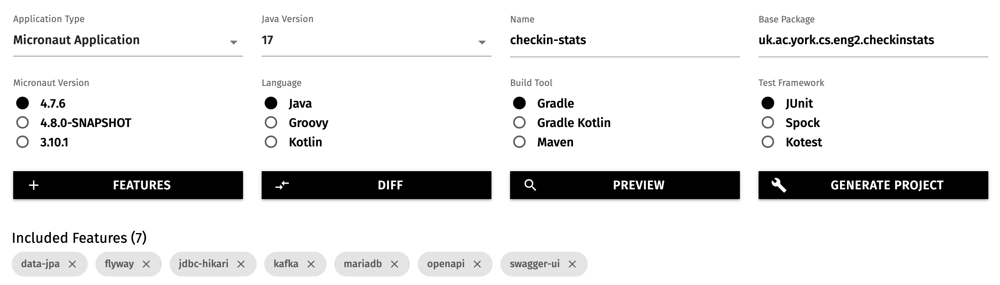
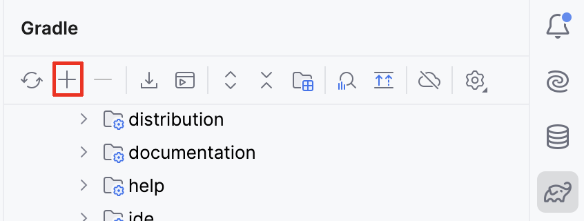
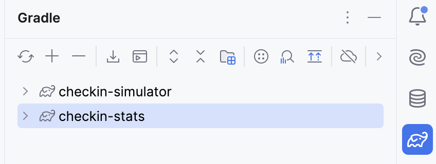

# Creating the project

For this practical, you will need to run two Micronaut applications at the same time:

* The simulator available [here](../../solutions/practical3-simulator.zip), which you should download, unzip, and open in your IDE. You should only need to run its `run` Gradle task (with Docker Desktop running) to have it start producing events.
* A new `checkin-stats` Micronaut application that you will have to create via [Micronaut Launch](https://micronaut.io/launch/).

## Using Micronaut Launch

Similarly to Practical 1, you should open Micronaut Launch on your browser, and fill in the form according to what we need.
In this case, you should fill the form like this:

* Application type: Micronaut Application
* Java version: 17
* Name: `checkin-stats`
* Base package: `uk.ac.york.cs.eng2.checkinstats`
* Micronaut version: the latest non-SNAPSHOT 4.x version (4.7.4 as of writing)
* Language: Java
* Build tool: Gradle
* Test framework: JUnit

You should also pick these features:

* The `openapi` and `swagger-ui` features for the Swagger UI of Practical 1.
* The `data-jpa`, `flyway`, `mariadb`, and `jdbc-hikari` features for the object/relational mapping of Practical 2.
* The `kafka` feature that is new to this practical.

Do *NOT* pick the `kafka-streams` feature as we do not use Kafka Streams, and it can run into problems without the appropriate configuration.

Micronaut Launch will look like this:



## Adding the project to IntelliJ

We assume that you already downloaded the simulator at the top of this section, and opened it in IntelliJ.

Download the new `checkin-stats` project from Micronaut Launch, and unzip it.
Rather than opening it directly (which will prompt IntelliJ to open the project in a new window or replace this window), we will add it to our workspace so we can refer to both projects at once.

To do so, use the "+" button in the "Gradle" drawer of IntelliJ, as on this screenshot:



Point IntelliJ to the main folder of the new project (containing the `build.gradle` file), and after some time you should see both the simulator project and your own project listed in the Gradle drawer, like this:



## Sharing the Micronaut Test Resources server

Double check that the `build.gradle` files in both Gradle projects contain this text:

```groovy
testResources {
  sharedServer = true
}
```

This bit of configuration tells Micronaut to share the Test Resources server between both projects.
Remember that Test Resources is the one provisioning MariaDB database servers and Kafka clusters whenever required for local development and testing.

If at any point you want to throw away the current state of your MariaDB database and/or your Kafka cluster (to start from a clean slate), you can follow these
steps:

1. Stop your Micronaut applications.
1. Stop the Test Resources server through `stopTestResourcesService` Gradle task in the `Tasks -> micronaut test resources` folder.
1. Start again your Micronaut applications.
