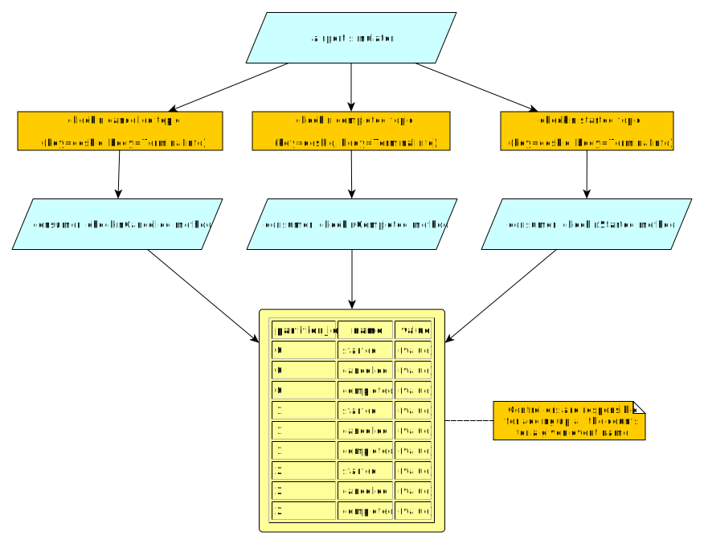

# Check-in statistics

Let's start consuming records from Kafka.
First, we will give an overview of the simulator that you downloaded, and then we'll start with the first exercise: obtaining overall counts of automated check-ins that were started, completed, and cancelled.

## The simulator project

This is the project that we asked you to download.
It is a Micronaut application that regularly produces events in a number of Kafka topics.
You will use it as-is: do not make any changes to it.

### The core simulation

The simulator itself is the `AirportSimulator` class.
It is a plain Java class that implements a `tick` method which runs a "tick" of the simulation.
At each tick, a number of things happen:

* All working desks send a status update, confirming they still work.
* A check-in process may be started in some desks.
* A check-in process may be completed in some desks.
  * Completing a check-in process will use up a piece of paper.
  * When a desk has less than a certain amount of paper, it will send low-paper events.
  * When a desk runs out of paper, it is considered to go out of order: it will send status updates, but it will not be able to complete check-ins.
* A check-in process may be cancelled in some desks.
* A desk may crash and stop sending status updates or completing check-ins.
* A desk may go out of order due to a mechanical failure, even if it has paper.

For each of these situations, `AirportSimulator` will invoke its `fireEvent` method mentioning the type of event and the terminal (check-in desk) involved.

### Making the simulator produce Kafka records

`AirportSimulator` is unaware of Kafka, and does not run on its own: someone has to invoke `tick` regularly to make it advance the simulation.

`ProducingAirportSimulator` extends `AirportSimulator`, overriding `fireEvent` so that it translates the simulation event into a Kafka record which is sent to one of several Kafka topics.
Their names are in constants inside the `AirportTopicFactory` class:

```java
public static final String TOPIC_CANCELLED = "selfservice-cancelled";
public static final String TOPIC_CHECKIN = "selfservice-checkin";
public static final String TOPIC_COMPLETED = "selfservice-completed";
public static final String TOPIC_LOWPAPER = "selfservice-lowpaper";
public static final String TOPIC_OUTOFORDER = "selfservice-outoforder";
public static final String TOPIC_STATUS = "selfservice-status";
```

`ProducingAirportSimulator` also overrides the `tick` method.
It does not change its implementation, but it adds this Micronaut annotation:

```java
@Scheduled(fixedDelay = "${airport.tick.delay}")
```

This annotation means "invoke this method automatically according to a schedule", with `fixedDelay` meaning "repeatedly invoke this method indefinitely, waiting for the specified time after the completion of each invocation".
The value for `fixedDelay` is an expression that is expanded by Micronaut during application startup, using the value provided in the `src/main/resources/application.properties` file by default:

```text
airport.tick.delay=100ms
```

Note how the class itself is annotated as a `@Singleton`, meaning that Micronaut will automatically create an instance of it, and then invoke its `tick()` method according to the schedule we saw above.

### Producing Kafka records

Have a look at the `AirportEventProducer`: you'll see that the records for these topics all have the same structure - the key is the terminal ID, and the body is a `TerminalInfo` record with two fields (whether it's stuck, and how much paper is left).
Record types were introduced in Java 14 - this is what `TerminalInfo` looks like:

```java
@Serdeable
public record TerminalInfo(boolean stuck, int paperLeft) {}
```

`record`s are special classes intended to hold a few immutable values, and automatically provide accessor methods, `equals()`, `hashCode()`, and `toString()` implementations.
`TerminalInfo` is `@Serdeable` so we can turn it into JSON when we produce Kafka messages that use it, and read it back when we consume Kafka messages.

### Automated topic creation

Have a quick look at the `AirportTopicFactory`: this is a `@Factory` that creates a number of `@Bean`s on application startup.
The beans are `NewTopic` objects that will be used to automatically create the needed topics in the Kafka cluster, if they do not already exist.

### Printing out produced messages for debugging

There is also a `DebugAirportEventConsumer` which consumes all of these events and just prints a message in each case.
This is mostly useful for debugging, hence the name.

## First exercise

Now that you have an understanding of the simulator project and the topics it produces records for, it's time for the first exercise.

The idea is to consume the records from the topics related to starting, completing, and cancelling check-in processes, and have a `GET /stats` endpoint which will return a JSON object like this one:

```json
{
    "started": 200,
    "completed": 50,
    "cancelled":  40
}
```

The overall process will look like this:



This will take a number of steps: we will give you general pointers for each step.

Remember that all changes should take place in your own application (`checkin-stats`).
As said above, you should not have to make any changes to the simulator application.

### Adding the database migration

Since this is stateful event processing, we need to maintain the state in a persistent location that will survive restarts, and will be accessible to all consumers.

Create a new database migration script called `V1__create-checkin-stats.sql` in the `src/main/resources/db/migration` folder, with this content:

```sql
create sequence hibernate_sequence;

create table partitioned_checkin_stat (
    id bigint primary key not null,
    name varchar(255) not null,
    partition_id int not null,
    value bigint not null default 0,
    constraint uk_stat_partition unique (partition_id, name)
);
```

You may recall from Practical 2 that `hibernate_sequence` is the database sequence used by Hibernate to automatically generate primary keys when it needs to.

The `partitioned_checkin_stat` table is an example of *partitioned state*, where we avoid interference between consumers by keeping different parts of the state for each Kafka partition.
A partitioned check-in statistic has a name (e.g. `started`), a partition ID (e.g. 1), and a value (the number of times that has happened so far).

We have also defined a `unique` constraint, saying that we can only have one row for a given combination of `(partition_id, name)`.
This `unique` constraint has two benefits:

* It helps with data integrity, as we avoid having two values by mistake for the same combination.
* It helps with performance, as unique constraints typically imply the creation of an index (e.g. some form of B-tree) which will dramatically speed up the retrieval of the value for a given `(partition_id, name)` combination.

### Adding the entity and repository

Based on what you learned in Practical 2, create the `PartitionedCheckinStat` entity class for the above table, and its associated repository.

You will need to add a custom query to your repository, which can find the `PartitionedCheckinStat` that has a certain partition ID and name.
Remember that custom queries are written by naming your methods according to the conventions in the Micronaut Data documentation.

We will give you this custom query as an example, but you will have to figure out the others in this practical:

```java
Optional<PartitionedCheckinStat> findByPartitionIdAndName(int partitionId, String name);
```

### Copying over some useful code

You will need some bits of code from the simulator project:

* Copy over the `TerminalInfo` record to a new `.events` subpackage of your main package.
* Create a new `CheckinTopics` interface inside the new `.events` subpackage, and copy over the `TOPIC_*` constants from `AirportTopicFactory`.

### Writing the actual consumer

Our database code is ready, and we have the necessary information about the topics to be consumed.
We can finally write our first consumer.

Create a class called `CheckinStatisticsConsumer` in the `.events` subpackage, and add this annotation:

```java
@KafkaListener(
    groupId="checkin-desks",
    threads = 3,
    offsetReset = OffsetReset.EARLIEST
)
```

The annotation has this meaning:

* `groupId` indicates that the consumers will join the `checkin-desks` group in the Kafka cluster.
  Since we will write many different consumer classes in this practical, each class will need its
  own group.
  The default is equal to the name of the application (what you entered in Micronaut Launch).
* `threads` indicates how many concurrent copies of the consumer we will run for each instance of our microservice.
  We want to ensure that our consumer works well when other consumers join or leave the group, so we have set it to the number of partitions that we have used for most topics.
  The default is 1 (only run one copy of the consumer per microservice).
* `offsetReset` indicates from what point should the consumer group start when first created.
  We are using `EARLIEST` so a new consumer group will start from the beginning of each topic.
  The default is `LATEST`, which would have a new consumer group only process the records that are produced after its creation.

Inject the repository for your `PartitionedCheckinStat` entities into this consumer.

Define three consumer methods:

* One which takes the `CheckinTopics.TOPIC_CHECKIN` events and creates or increments the value associated to the "started" statistic and the partition of the record.
* Same for `CheckinTopics.TOPIC_CANCELLED`, but the name is "cancelled".
* Same for `CheckinTopics.TOPIC_COMPLETED`, but the name is "completed".

The methods have to meet a number of requirements:

* They should be annotated as `@Transactional`, as you will need to first check the existing value (if it exists), and then create or increment it as needed. Those are multiple database accesses that should happen all at once or not at all (hence the need for a transaction).
* They should use the `@Topic(topic)` annotation to indicate the topic that they will be consuming from.
* Their only parameter will be `@KafkaPartition int partition`: the `@KafkaPartition` annotation ensures Micronaut will bind the partition of the record to the `partition` parameter.

You should know how to create or update the existing record from what you learned in Practical 2.
Remember to use the custom query that we defined above.

## Testing your consumer

Once you have a first version of your consumer, it's time to test it.

Create a `CheckinStatisticsConsumerTest` test class within a new subpackage of your main package within the `src/test/java` source folder.
These tests will involve the database, so you will need to ensure a few things:

* Tests should not run within a transaction.
* All existing rows should be deleted before each test runs.

Inject the consumer into the test class.

Write test cases that call your consumer methods and check that the database is updated as expected.
We recommend using separate tests for the logic associated to each topic.

Note: by invoking the consumer methods directly, we're testing the logic of our consumer in isolation of the Kafka cluster.
This simplifies the tests, as we do not need to prepare the Kafka cluster before each test.
Later in the module, we will discuss how to automate *end-to-end* tests that cover the interactions between all the parts.

## Writing the controller

Now that we know that the consumer works as intended, we can expose it as a `GET /stats` endpoint.

Based on what you learned on Practicals 1 and 2, create a controller that will produce a JSON output similar to the one at the top of this section.
Note that you will need to obtain all the `PartitionedCheckinStat` (which should be fast as there won't be more than 9 of them), and sum their values across partitions for each unique name.

In this case, you could simply populate a `Map<String, Long>` and return it (which will automatically adapt to new names among the `PartitionedCheckinStat` entries), or you could create a dedicated DTO (which will need to be updated every time you want to track a new statistic).

## Trying everything together

With the consumer and the controller both ready, try this:

* Launch the `run` task of the simulator. After some time, you will start seeing messages about check-in events taking place. Leave it running.
* Launch the `run` task of your `checkin-stats` project.
* Open the [Swagger UI](http://localhost:8080/swagger-ui) and try invoking your endpoint.
  You should see the expected output, and the counts should automatically increase over time as you consume events.

Once everything works, stop both the simulator and the `checkin-stats` application.
We can move on to the next exercise.
