# Conference DSL queries

Write five EOL queries (Q1-Q5) that print:
- **Q1**: The number of days the conference lasts
- **Q2**: A set of unique affiliations of participants of the conference
    - i.e. if multiple persons have the same affiliation, the affiliation should appear only once in this set
- **Q3**: The total duration of all talks in the conference
- **Q4**: A set of all the names of the rooms in which breaks take place
- **Q5**: The number of tracks that start before noon
    - Reminder: `Slot.start` and `Slot.end` are strings that use the `HH:MM` format (e.g. 15:30).

Instructions for running your EOL queries against a conference model are provided [below](#running-queries-q1-q5).

## Solutions

```eol
// Q1
// Day.all returns a collection
// with all the instances of
// Day in our model
Day.all.size().println();
```

```eol
// Q2
// Collect the affiliations of
// all persons, and then filter
// out duplicates using asSet()
Person.all.collect(p|p.affiliation).asSet().println();
```

```eol
// Q2
// More verbose version that uses
// a for loop instead of .collect()
// You should avoid writing such code
var affiliations : Set;
for (p in Person.all) {
    affiliations.add(p.affiliation);
}
affiliations.println();
```

```eol
// Q3
// Get a list with the durations
// of all talks and compute their
// sum
Talk.all.collect(t|t.duration).sum().println();

// ... or more concisely
Talk.all.duration.sum().println();
```

```eol
// Q4
// Collect the rooms of all
// breaks and then collect
// the names of these rooms
Break.all.collect(b|b.room).asSet().collect(r|r.name).println();

// ... or more concisely
Break.all.room.asSet().name.println();
```

For Q5, we will need to define a few helper operations for working with `HH:MM`-formatted times first. For now, we assume that string values under `Slot.start` and `Slot.end` conform to the `HH:MM` format. Later on, we will encode (and check) this assumption using a validation constraint.

```eol
// Q5
// Select all tracks that start before noon
// and compute the size of the returned collection
Track.all.select(t|t.start.isBefore("12:00")).size().println();


// Get the hours part of the string
// and convert it to an integer
// e.g. for 15:45 it returns 15
operation String getHours() {
    return self.split(":").at(0).asInteger();
}

// Same for the minutes part
operation String getMinutes() {
    return self.split(":").at(1).asInteger();
}

// Compares the string on which it is invoked
// with its time parameter e.g.
// "15:15".isBefore("18:00") returns true
operation String isBefore(time : String) {
    return (self.getHours() < time.getHours()) or 
        (self.getHours() == time.getHours() and 
        self.getMinutes() < time.getMinutes());
}
```

<div class="warning">
<b>Statements after operations are ignored</b>

The EOL execution engines ignores any statements that appear after the definition of the first operation in a `.eol` file. Therefore, if you were to move the first statement in the example above (`Track.all.select(t|t.start.isBefore("12:00")).size().println();`) to the end of the file, it would not get executed.
</div>

## Running queries Q1-Q5

- To run these queries you will need
    - The Ecore metamodel of the Conference DSL;
    - A sample model that conforms to it;
    - An EOL file that contains your queries.
- You should already have `conference.ecore` (Ecore metamodel) and `conference.model` (sample model) in your workspace after following [the instructions at the start of this practical](./index.md#before-you-start).
- Create an empty text file named `conference-queries.eol` within your `conference-dsl` project.
- Right-click on `conference.ecore`.

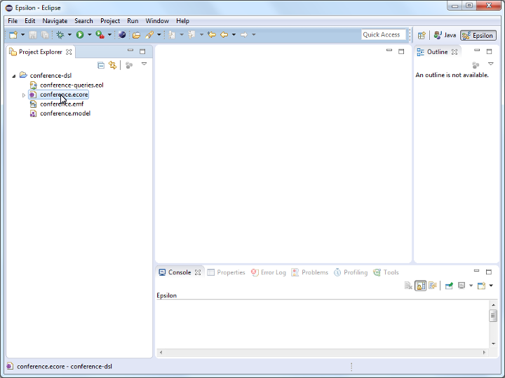

- Click on the `Register EPackages` menu item. This will register the metamodel with EMF so that it can load models (such as `conference.model`) that conform to this metamodel.

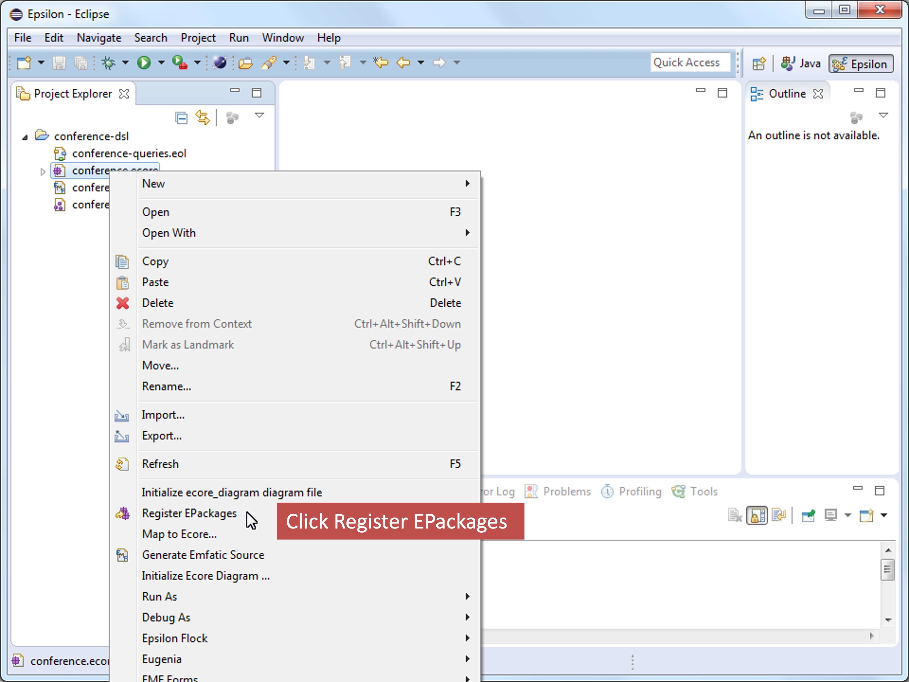

- Open your `conference-queries.eol` file and type/paste your queries in it.

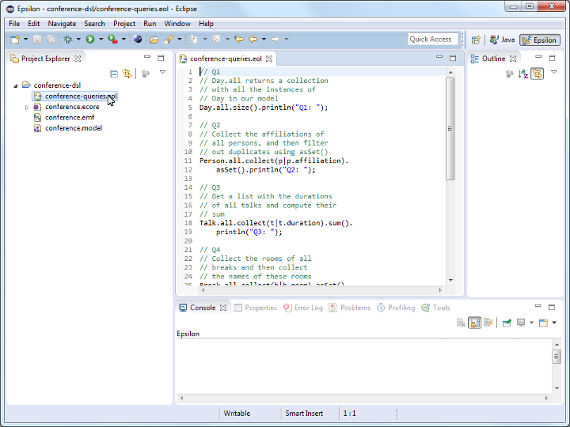

- Create a new `EOL Program` run configuration to run your EOL queries.

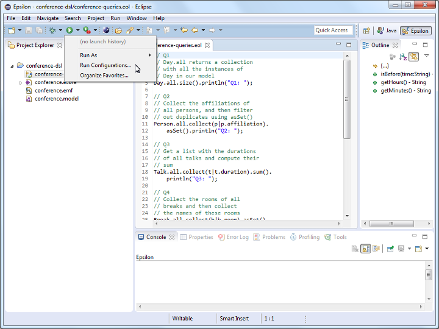
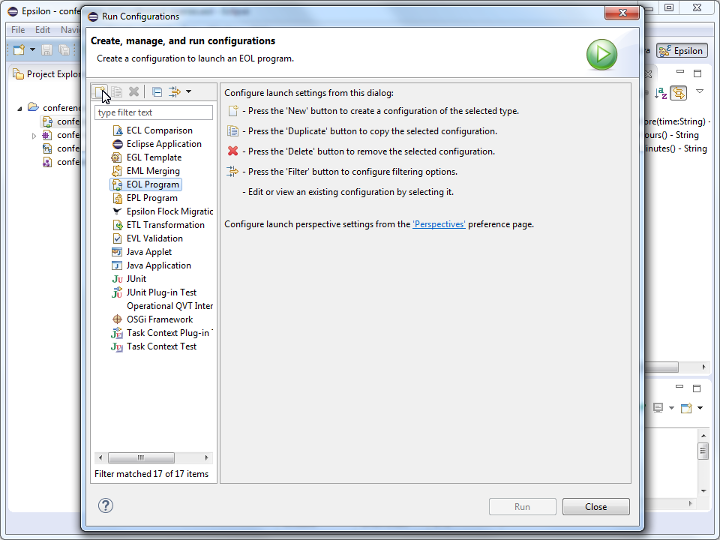

- Double-check that the path of your EOL file appears in the `Source` field of the `Source` tab of the run configuration dialog.

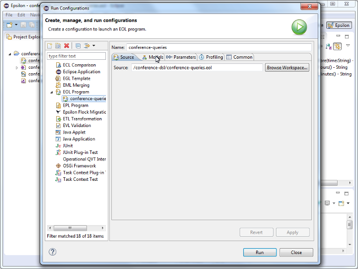

- Add the Conference model (`conference.model`) to the run configuration through the `Models` tab of the dialog.

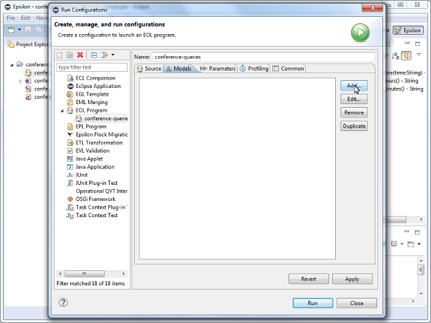
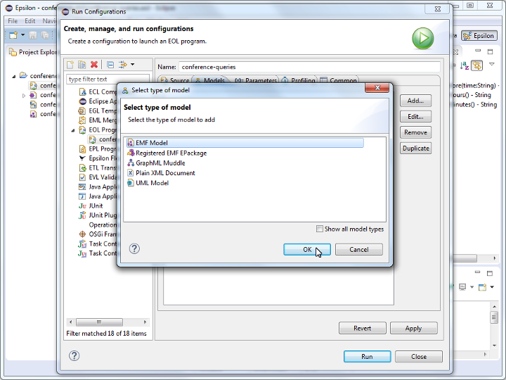

- Set the name of the model to `M`

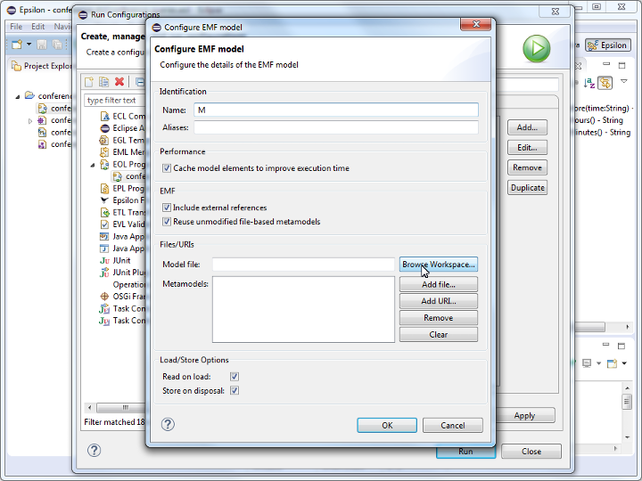

- Select `conference.model` as the model file. If the file selection dialog is empty, start typing the name of the file or `**` to display all workspace files. 

<div class="warning">
<b>Have you selected the model file?</b>

Double-check that you have selected the model file (`conference.model`) and **not** the metamodel file (`conference.ecore`) in this step. This is a common mistake to make.
</div>

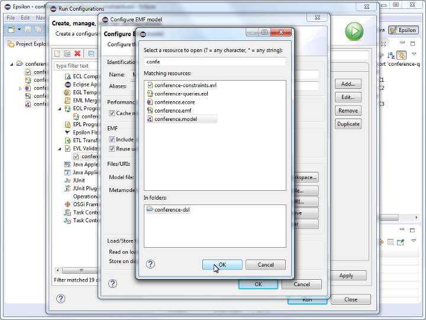

- As soon as you select `conference.model`, the URI of its metamodel (`conference`) should be added to the `Metamodels` list of the dialog. If it doesn't, it means that you have either not selected the correct model file, or that you have not registered your metamodel (`conference.ecore`) with EMF (see earlier steps).

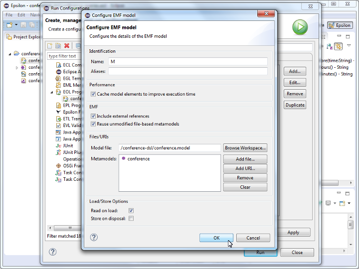

- Click the `Run` button.

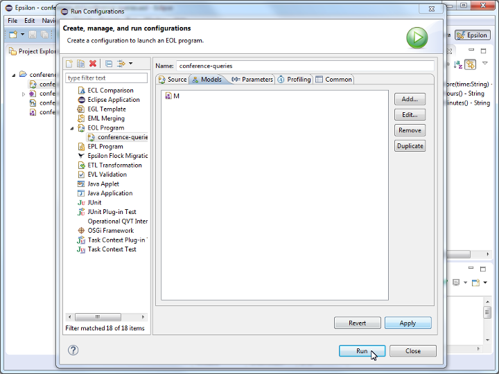

- The output of your queries should appear in the `Console` view.

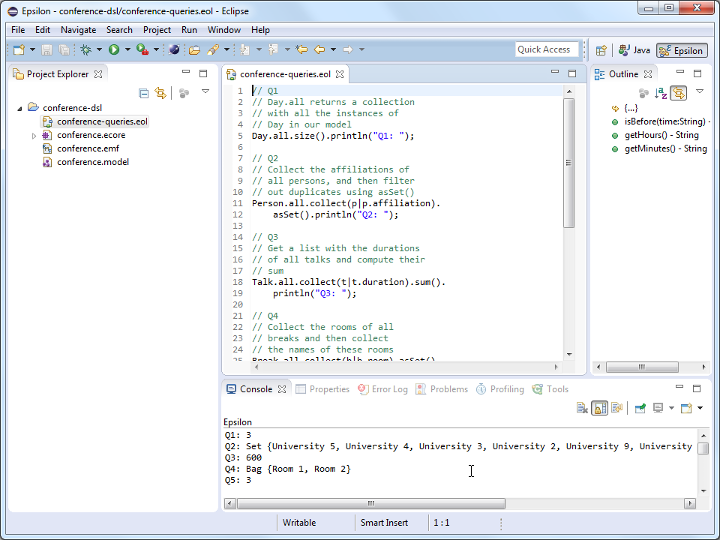

