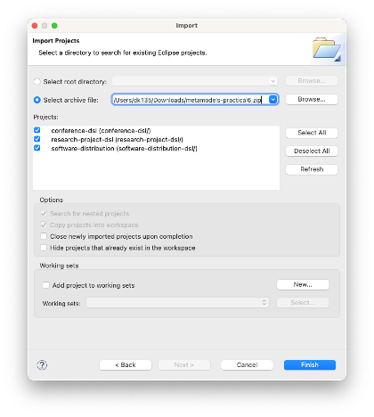

# Model querying and validation

- In the previous practicals, you implemented three metamodels and constructed models that conform to them 
- In this practical you will write model management programs and run them against models to
    - Query them
    - Validate them against complex constraints

## Before you start

- Download [this zip file](metamodels-practical6.zip) that contains Eclipse projects with metamodels, models etc. from [Practical 6](../modelling-and-metamodelling/README.md).
- Import the projects in the zip file to your Eclipse workspace using the `File -> Import -> Existing Projects into Workspace` wizard as shown below

