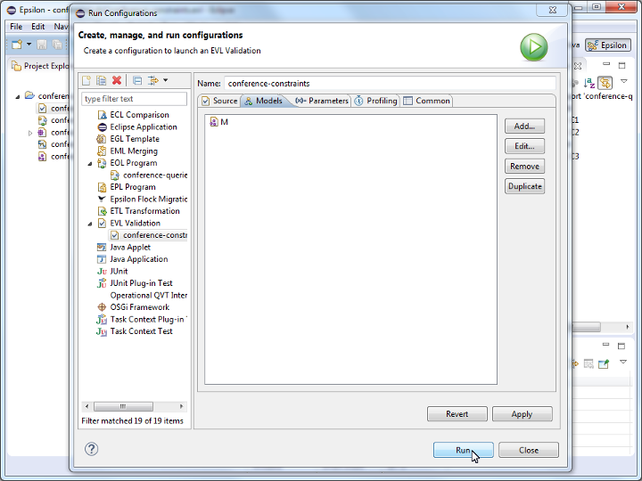

# Model Validation

We now wish to write [EVL](https://eclipse.dev/epsilon/doc/evl) constraints for the Conference DSL, which check that:

- **C1**: The speaker and the discussant of a talk are two different persons
- **C2**: The duration of a talk is a positive number
- **C3**: The start time of a slot (i.e. break, track) is before its end time

## Constraints C1-C3

```evl
import "conference-queries.eol";

context Talk {

    constraint C1 {
        check : self.speaker <> self.discussant
        message : "The speaker and the discussant of talk " 
            + self.`title` + " are the same person"
    }

    constraint C2 {
        check : self.duration > 0
        message : "The duration of talk " + self.`title` +
            " is not a positive number"
    }
}

context Slot {
    
    constraint C3 {
        check : self.start.isBefore(self.end)
        message {
            var msg = "";
            if (self.isTypeOf(Break)) {
                msg = "Break " + self.reason;
            }
            else {
                msg = "Track " + self.`title`;
            }
            msg = msg + " on " + Day.all.selectOne(d|d.slots.includes(self)).name;
            msg = msg + " ends before it starts";
            return msg;
        }
    }
}
```

- Both `C1` and `C2` check the validity of `Talk` model elements. As such they can be placed under the same `Talk` context.
- The property `title` appears between back-ticks in the expression ``self.`title` `` because it is a reserved word (keyword) in EVL
- In C3 we need to compare two `HH:MM`-encoded dates. We've already [written code](./conference-dsl-queries.md#conference-dsl-queries) that does this in the first part of this practical. As such, instead of duplicating this code, we can import the respective EOL file (see the `import conference-queries.eol;` statement at the top of the EVL program).
- The message we have provided for C3 is too generic and not very helpful for locating offending slots. An improved version of the constraint that produces a more meaningful error message is below.

## Evaluating constraints

- Create a new text file with the name `conference-constraints.evl` in your `conference-dsl` project and type/copy the implementation of constraints C1-C3 in it.


- Create an `EVL Validation` run configuration to execute the constraints against the `conference.model` model. The process of setting up the run configuration is very similar to the [process you followed to run your EOL program](./conference-dsl-queries.md#running-queries-q1-q5), so we won't repeat the instructions alongside the following screenshots.




- Running the EVL program should report three unsatisfied constraints in the `Validation` view of Eclipse.


- Fix these issues in `conference.model` and re-run the EVL constraints until no errors are reported in the `Validation` view.

## Exercise

Write and run the following constraints for the Conference DSL similarly to C1-C3 demonstrated above:

- **C4**: A track is long enough to accommodate the talks it contains
    - e.g. a track that is one hour long cannot accommodate three 30-minute talks
- **C5**: Breaks don't overlap with tracks
- **C6**: Slots that overlap in time do not use the same room