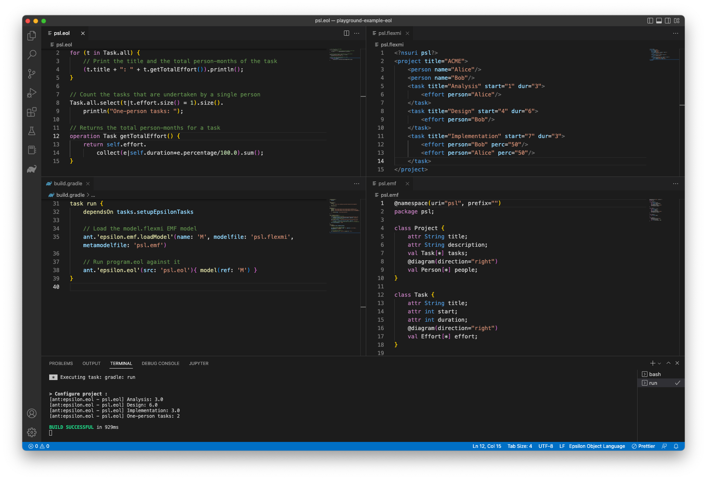
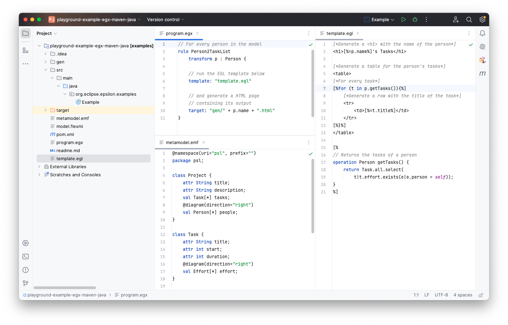

# Additional exercises

Download the following transformations from the Epsilon Playground and run them in your Java IDE of choice as discussed [here](https://eclipse.dev/epsilon/doc/articles/playground/#download-your-work).

- [Generate Task Lists (M2T)](https://eclipse.dev/epsilon/playground/?egx)
- [Transform to Deliverables (M2M)](https://eclipse.dev/epsilon/playground/?etl)

## Epsilon development tools for VS Code and IntelliJ

