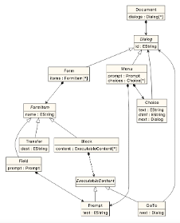

# Model-to-Model transformation

As a warm-up exercise, modify [this M2M transformation](https://www.eclipse.org/epsilon/live/?etl) on Epsilon's playground so that it generates 2 deliverables per task
- One interim report in the middle of the task
- One final report at the end of the task

## Exercise

Write a M2M transformation with ETL that produces a MiniVoiceXML model from a call centre model. MiniVoiceXML is a toy version of the [W3C VoiceXML specification](https://www.w3.org/TR/voicexml20/).

### MiniVoiceXML metamodel

- A `Document` has 0+ `Dialogs`, which can be `Forms` or `Menus`: execution starts from first `Dialog`
- A `Form` has 0+ `FormItems`: `Form` gets inputs from the caller and assigns them to variables
    - `Field`: prompt the caller, read line of input, and assign input to var with given `name`
    - `Transfer`: transfer the caller to another number (`dest` uses `tel:NUMBER`)
    - `Block`: 0+ executable elements
        - `GoTo`: switch to another Dialog
        - `Prompt`: output text to user
- A `Menu` has a `Prompt` and 1+ `Choice`: runs the `Prompt` then shows options and waits for choice
    - `dtmf`: number (1-9) to be typed by caller
    - `next`: Dialog to traverse to if chosen

### The transformation

- Clone [this Github](https://github.com/uoy-cs-eng2/minivoicexml)
    - Alternatively, [download a copy of its contents](https://github.com/uoy-cs-eng2/minivoicexml/archive/refs/heads/main.zip)
- Import the metamodel project (`minivoicexml`) into Eclipse
- In a nested Eclipse, import the interpreter (`minivoicexml.interpreter`) project
- In the nested Eclipse, create a new project named `callcentre2minivoicexml`
- In the new project, create an ETL script with these rules:
    - `Model` → `Document` with the `Dialogs` produced from the `Steps`
        - The first `Dialog` should be the one from the first `Step` that would be run
    - `Statement` → `Form` with `Block` containing a `Prompt`
    - `CallRedirection` → `Form` with `Transfer` (watch out for `dest` format)
    - `InputQuestion` → `Form` with `Field` containing a `Prompt`
    - `Decision` → `Menu` with `Prompt`
    - `Transition` →
        - If the source is a `Decision`: add `Choice` to the `Menu` from the source node
            - Remember to set the `dtmf`, `text`, and `next` features correctly!
        - Any other: add `GoTo` to the `Block` at the end of the `Form` from source node
            - If such a `Block` does not exist, add it as well
            - Remember to set the `next` reference to the equivalent of the `Transition` target
- Run your ETL script on your sample model:
    - Configure the launch so the new model is saved to `generated-voicexml.model` inside your `callcentre2minivoicexml` project
- Run the resulting MiniVoiceXML models on the interpreter:
    - In `minivoicexml.interpreter`, right-click on `Launcher.launch`, select `Run As –> Launcher`
    - The interpreter will run from the `Console` view: check that the model behaves as expected by entering your answers

## Solution

- A [reference solution](https://eclipse.dev/epsilon/playground/?callcentre2minivoicexml) is available on Epsilon's playground.
