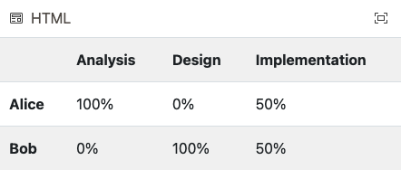

# Model-to-text transformation

As a warm-up exercise, modify [this M2T transformation](https://www.eclipse.org/epsilon/live/?psl2html) in Epsilon's online playground so that it generates a table with task names as column headers and person names as row headers, as shown below.

## Problem

While the `callcentre2java` model-to-text transformation discussed in the M2T lecture works fine for models that end with call redirections, it crashes for models that end with statements.

## Preparation

<!--TODO: Update the example so that the design project is in the first workspace -->
<!--TODO: Also rename the repo from sirius-example to callcentre-sirius? -->

- Clone [this Github repository](https://github.com/uoy-cs-eng2/sirius-example)
    - Alternatively, [download a copy of its contents](https://github.com/uoy-cs-eng2/sirius-example/archive/refs/heads/main.zip)
- Run the Epsilon Eclipse distribution
- Import only the following projects from the repository/zip file
    - `ac.uk.york.callcentre`
    - `ac.uk.york.callcentre.edit`
    - `ac.uk.york.callcentre.editor`
    - `ac.uk.york.callcentre.validation`
- Make sure that all imported projects are under the `H:` or `C:` drives 
- You can double-check their location by right-clicking on them in Eclipse and selecting the `Properties` menu item
- Run a nested Eclipse instance by right-clicking on one of the projects above within Eclipse and selecting `Run as -> Eclipse Application`
- In the nested Eclipse instance import only the following projects from the repository/zip file 
    - `ac.uk.york.callcentre.design`
    - `ac.uk.york.callcentre.m2t`
    - `acmebank.model`
    - `acmebank.application`
- Run the `callcentre2java.egx` EGX M2T transformation against the `acmebank.callcentre` model so that it generates code under the `acmebank.application` project
    - Create a new `EGL Generator` run configuration (like you did for EOL and EVL in previous practicals)
    - Set its source to `callcentre2java.egx`
    - Set the `Files should be generated in` directory to the `acmebank.application` project
- Run the generated `AcmeBank.java` class
    - Optional: implement the validation logic for PINs as shown in the M2T lecture

## Fix the M2T transformation

- Add a `Thank you for calling Acme Bank` statement to your model, and a transition to it as shown in the [problem description](#problem)
    - Don't forget to give the new statement a name in the `Properties` view!
- Re-run the M2T transformation and notice how it crashes with a runtime exception (`Called feature 'to' on undefined object`)
- **Exercise #1**: Modify the source code of the M2T transformation to fix the problem

## Extend the M2T transformation

- In the current version of the generated code, a user needs to enter the number of the transition they wish to take at decision points
    - e.g. `1 for yes, 2 for no` in `Are you an existing customer?`
- **Exercise #2**: Modify the M2T transformation so that the code produced accepts both the number and the text of the transition
    - e.g. `1 or "yes" for yes, 2 or "no" for no` in `Are you an existing customer?`

## HTML generation

- So far, you have been modifying the existing callcentre2java.egx M2T transformation
- **Exercise #3**: write a new M2T transformation that transforms a call centre model into a set of HTML pages
    - One HTML page for each step
    - Hyperlinks in the generated pages to represent transitions

