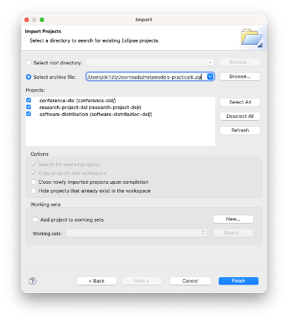

# Introduction

In this practical you will use the the [Epsilon Validation Language (EVL)](https://eclipse.dev/epsilon/doc/evl) for model validation. EVL extends the syntax of EOL so it is important that you attempt the model querying exercises of Practical 8 before you move on to model validation.

## What you should already know

- How to define domain-specific metamodels using Emfatic.
- How to create models that conform to such domain-specific metamodels.
- How to write and run EOL queries on EMF-based models.

## What you will learn

- How to write and run EVL validation rules on EMF-based models.

## What you will need

- An Eclipse installation with EMF and Epsilon (see the [Tools](../modelling-and-metamodelling/tools.md) section of Practical 6).
- Before you attempt the exercises in this practical you will also need to
    - Download [this zip file](../../solutions/practical6.zip) that contains Eclipse projects with metamodels, models etc. from [Practical 6](../modelling-and-metamodelling/index.md).
    - Import the projects in the zip file to your Eclipse workspace using the `File -> Import -> Existing Projects into Workspace` wizard as shown below.

