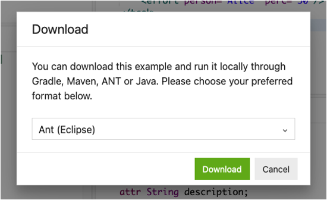
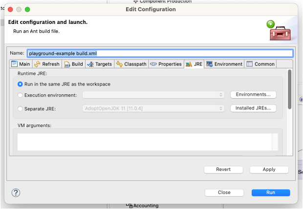

# Ant workflows

## Running the EGL example via Ant

Download a copy of the [Generate Task Lists EGL example](https://eclipse.dev/epsilon/playground/?egx) from the Epsilon Playground.

Make sure to choose the "Ant (Eclipse)" option from the Download dialog:



Import the downloaded project into Eclipse, and then right-click on `build.xml` and select "Run as -> Ant build...".

In the window that pops up, in the JRE tab, select "Run in the same JRE as the workspace":



Click Run.

## Combining the EVL and EGL scripts

Modify `build.xml` so that the constraints in [the related EVL example](https://eclipse.dev/epsilon/playground/?evl) are executed before the EGL model-to-text transformation. For more information, see slide 7 of the Model Management Workflows lecture.

First, paste the Ant tasks in the main target of the EVL `build.xml` before the ones in the EGL `build.xml` file.
Ensure this works as intended, by changing `model.flexmi` so that it violates one of the EVL constraints (e.g. set the duration of the Analysis task to a negative number), and running `build.xml` again: the build should fail in the validation step and code generation should not take place.

The above approach would result in a significant amount of duplication, and it would also mean loading the model twice (once before EVL, and again before EGL). Change the buildfile so it only loads the model once at the beginning, runs EVL, then EGL, disposes of the model, and refreshes the project in Eclipse.

Finally, let's take advantage of the fact that Ant targets can [depend on each other](https://ant.apache.org/manual/targets.html), like this:

```xml
<!-- A, B, and C will be automatically run before X starts -->
<target name="X" depends="A,B,C">
  ...
</target>
```

Reorganise the `build.xml` so it has these targets:
* `load-model` target only loads the model.
* `dispose-model` target disposes of the model and refreshes the project.
* `run-evl` target only runs the EVL script, and depends on `load-model`.
* `run-egl` target only runs the EGL script, and depends on `load-model`.
* `main` target depends on `run-evl`, `run-egl`, and `dispose-model`, in that order, and is otherwise empty.

Ensure the build still works as expected before moving on.

## Solutions

Model solutions for the exercises are available in [this ZIP file](../../solutions/practical10.zip).
