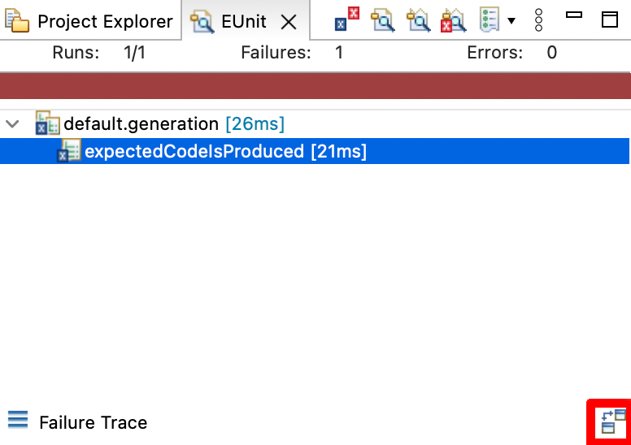
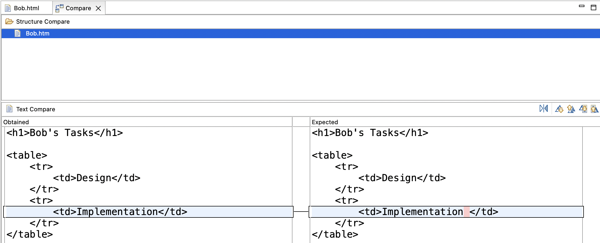

# EUnit testing

In the previous section, you reorganized the `build.xml` so there would be separate `run-egl` and `run-evl` targets to run the EGL and EVL scripts in this example.

Let's use these same targets to test with EUnit that our validation and code generation works as intended.

## EVL testing

Create a new `test-evl` task that uses the `epsilon.eunit` task to run a `validation.eunit` script which tests known-good and known-bad models for each of the constraints.

The `epsilon.eunit` task will need a `<modeltasks>...</modeltasks>` element inside it, which will load an empty model `M` with the same metamodel as in the `load-model` Ant target.
Use `read="false"` and `store="false"` so that we will not try to read a file that does not exist, and we will not try to save it either.

You will also need a separate copy of the `run-evl` target that is dedicated to testing: call it `run-test-evl`.
In this copy, the `epsilon.evl` task would need these changes:

* It should export its results as a model (we usually name this model `EVL`).
This is mentioned in the EUnit lecture, and is described as the `exportAsModel` option in [the documentation](https://eclipse.dev/epsilon/doc/workflow/#model-validation-task).
* It should not fail on errors or warnings, so we can check its results from EUnit.
You need to set `failonerrors="false"` and `failonwarnings="false"`.

Write the EUnit script, with tests that check the validation passes for a sufficiently complete model (e.g. one person spending effort on a task with a valid start and duration), and that it fails when that model goes bad in different ways.
You can either populate the appropriate model from scratch inside each `@test` operation, or you could do the following:

* Create an operation with the `@model` annotation (as in the HUTN example in the EUnit lecture) and from inside it, use EOL to instantiate a known good model (e.g. using `new X` and setting fields accordingly).
* Have a `@test` that runs the EVL script against the unchanged model and ensures no errors are found.
* Have `@test`s that make a change that invalidate one of the EVL invariants, and check that the appropriate error is reported (and on the right model element).

Ensure that your tests pass before moving on.

## EGL testing

Now repeat the same approach, but for EGL.

In this case, you may want to use the `assertEqualFiles` or `assertEqualDirectories` [assertions in EUnit](https://eclipse.dev/epsilon/doc/eunit/#assertions) to compare files with the expected text against files with the actual text.
You can test that when given the example model, the output text will be the same as the one you're getting now: you can copy the current output to an `expected` folder and make comparisons across the `gen` and `expected` folders.

In order to do comparisons across files, you will need to know Ant's base directory from inside the `.eunit` script.
For that you will to pass in a `basedir` parameter to the EUnit script, set to the value of the Ant `basedir` property.
Ensure the `epsilon.eunit` task used to run the tests for the generator has this element inside it:

```xml
<parameter name="basedir" value="${basedir}" />
```

You will also want use a different output folder for testing than the real one (using `outputroot` in the `epsilon.egl` task), and to delete and recreate it before running the EGL script.
For this, we recommend making those changes on a separate `run-test-egl` target that is a copy of the `run-egl` target.
We explained how to delete and recreate the folder in the EUnit lecture.

Once your test is passing, try changing the expected output and seeing that EUnit detects the difference.
When a test fails due to a failed file comparison, you can view the detected changes by clicking on the failed test, and then on the "Compare Outputs" button (highlighted in red on the bottom right):



If you click on that button, you will get a file comparison editor mentioning various files, and if you double-click on one of those files, you will get a difference report like this one:



## Solutions

Model solutions for the exercises are available in [this ZIP file](../../solutions/practical10.zip).
