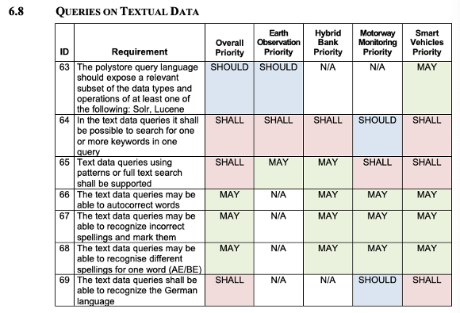

# Collaborative Project Requirements DSL

- A collaborative research project has several use-case partners, each contributing one or more use-cases, that will drive the requirements and evaluate the technologies developed in the project.
- Requirements are grouped into semantically cohesive clusters (work-packages)
- The importance of each requirement can be different for every use-case partner (shall/should/may)
- An example from a real project follows below

## Exercise

- Create a DSL for designing such requirements
- Create a model that conforms to the DSL and exercises all its features at least once

