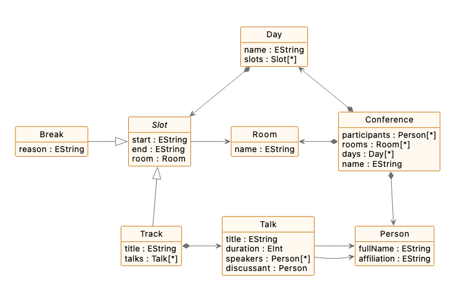

# Conference DSL

Design the metamodel of a DSL for modelling conferences using Emfatic. Below are key concepts and relationships your language must support.

- A conference runs over several days
- On every day, there are several talks organised in (potentially parallel) tracks
- There are breaks between tracks (e.g., for lunch/coffee)
- Each track/break takes place in one room
- Each talk can be delivered by one or more speakers
- Each talk has a pre-defined duration

## Why?

- To ensure that the conference program is clash-free e.g.
    - Parallel tracks happen in different rooms
    - The total duration of the talks of a track does not exceed the duration of the track
    - Breaks don't overlap with tracks
- To generate booklets, web-pages etc. from the program in a consistent manner instead of maintaining them manually (and risking inconsistency)

## Solution

Try to design your own metamodel before you check out the solution below (or download the [solution ZIP](../../solutions/practical6.zip)).

```emfatic
{{#include ../../../solutions/practical6/conference-dsl/conference.emf}}
```

A diagrammatic representation of the metamodel above can be found below.



<!--
@namespace(uri="conference", prefix="")
@diagram(monochrome="true")
package conference;

class Conference{
    val Person[*] participants;
    @diagram(direction="left")
    val Room[*] rooms;
    @diagram(direction="up")
    val Day[*] days;
    attr String name;
}

class Person {
    attr String fullName;
    attr String affiliation;
}

class Day {
  attr String name;
  val Slot[*] slots;
}

abstract class Slot {
    attr String start;
    attr String end;
    ref Room room;
}

@diagram(inheritance.direction="right")
class Break extends Slot {
    attr String reason;
}

class Track extends Slot {
    attr String title;
    @diagram(direction="right")
    val Talk[*] talks;
}

class Talk {
    attr String title;
    attr int duration;
    ref Person[*] speakers;
    ref Person discussant;
}

class Room {
    attr String name;
}
-->

## Notes on the solution

- This is only one possible solution. If your solution is not identical it does not mean that it is incorrect.
    - If you have any questions, please ask!
- The name of meta-class `Slot` appears in italics because it is an abstract class (i.e. it cannot be instantiated)
- References that start with a black diamond (val in Emfatic) are containment references
    - A talk can appear only under one track
    - A track can appear only under one day
    - Another way to think about it
        - If we delete a track, all its contained talks should be deleted with it
- References that don't start with a black diamond (`ref` in Emfatic) are non-containment references
    - Many slots can share the same room
    - Many talks can be given by the same speaker
    - Another way to think about it
        - Deleting a track should not cause the deletion of the respective room from the model
        - Deleting a talk should not cause the deletion of the respective speaker
- There are two "artificial" containment references in the model to keep EMF happy
    - `Conference.participants`
    - `Conference.rooms`
- In the absence of these references, `Person` and `Room` instances could not be contained anywhere in the model and would have to appear as top-level elements
EMF-based tools don't like models with multiple top-level elements
    - Hence we need to introduce these references so that all model elements can be contained somewhere under a root `Conference` model element

## Create a conference model

Create a model that conforms to the conference metamodel and exercises all its features at least once (i.e. instantiates all classes, contains values for all attributes/references) using the tree-based EMF editor **or** using [Flexmi](https://www.eclipse.org/epsilon/doc/flexmi/).

### Solution

Here is a sample model (contained in the [model solution](../../solutions/practical6.zip)) that conforms to the Conference DSL.

```xml
{{#include ../../../solutions/practical6/conference-dsl/conference.model}}
```