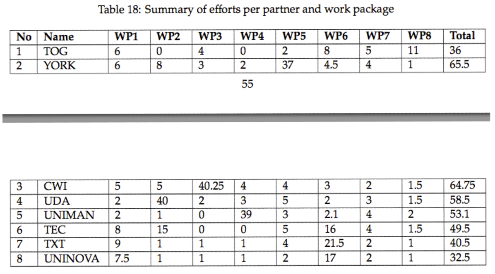

# Research Project DSL

- Research projects are typically conducted in a collaborative manner by a number of partners (universities, companies, charities etc.) and have a fixed duration (in months – e.g. 36 months)
- A project is split into a number of work-packages
- Each work-package has a start and an end month and is further broken down into more fine-grained tasks and deliverables
    - Tasks also have a start and an end month and each deliverable is due on a specific month
- Each partner declares how much effort (in person/months) they will allocate to each task
- Exercise
    - Create a DSL for designing such projects
    - Create a model that conforms to the DSL and exercises all its features at least once

## Why?

- Proposal documents contain several tables with overlapping information (see screenshots below) e.g.
    - Effort per partner per task for a work-package
    - Effort per partner for the whole project
    - Table of deliverables for the whole project in chronological order
    - A Gantt chart that summarises the timeline of the project
- Unless these tables are generated from a common source (i.e. a model) they can become inconsistent with each other
    - e.g. a partner may change their effort for a task but forget to change the overall effort figure for the entire project
- Other consistency problems can also appear e.g.
    - Tasks that start before / end after the work-package in which they are contained
    - Deliverables that are due after their work-package ends
- This is how we **actually** write proposals for research projects

## Screenshots

Below are a few screenshots of actual tables generated from a research project model for an EC-funded research project.

