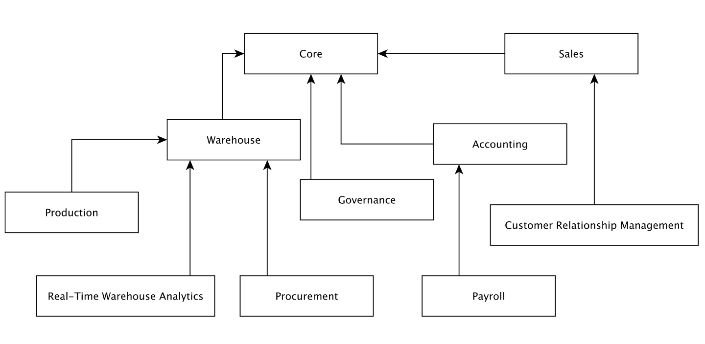

# Software Distribution DSL

- Software vendors need to build several bundles for different types of customers
All these bundles are typically assembled from the same pool of components
    - Different bundles contain different subsets of these components
- Components have dependencies between them
    - e.g. if component C2 depends on component C1, then bundles that contain C2 must always also contain C1

## Exercise

- Create a DSL for designing such bundles
- Create a model that conforms to the DSL and exercises all its features at least once

## Example

- You are a vendor of an Enterprise Resource Planning system implemented in Java that consists of several components
    - e.g. Sales, Warehouse, Payroll
- Each component consists of a number of JAR files
    - Components can share JARs
- The dependencies between your components are as shown below
- You wish to assemble different bundles for e.g.
    - Sole Traders: Core, Sales, CRM
    - Service Companies: Core, Payroll, CRM
    - Manufacturing Companies: All components excluding Real-Time Warehouse Analytics
    - Large Manufacturing Companies: All components

## Why?

- You could write a packaging (e.g. shell, ANT, Gradle) script for each distribution manually however
    - It would be error-prone
    - They would contain a lot of duplication
    - They would be hard to maintain for a large set of components
- Using a domain-specific model
    - You can capture bundle configurations at an appropriate level of abstraction
    - You can perform checks for e.g.
        - components with cyclic dependencies
        - components/JARs that are not used in any products (obsolete?)
- You can generate these packaging scripts automatically and they will be correct by construction
