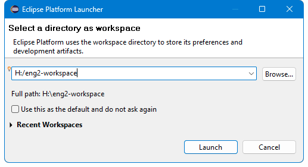
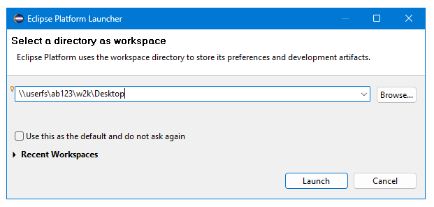
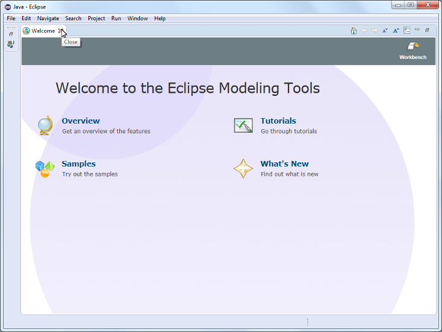
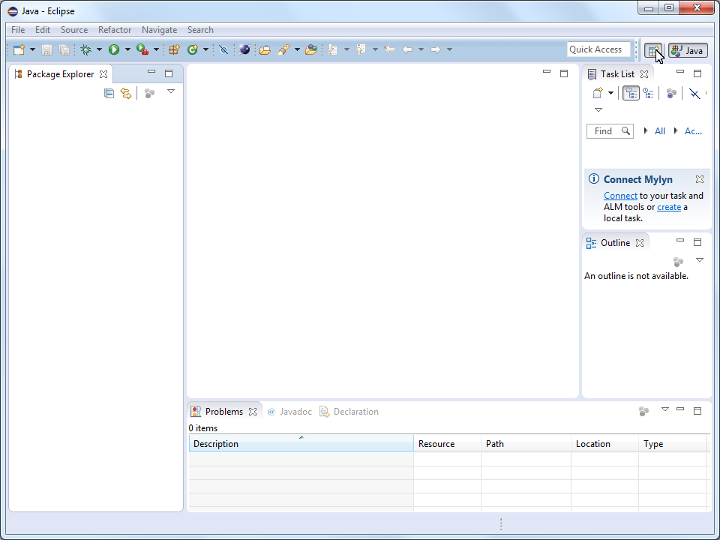
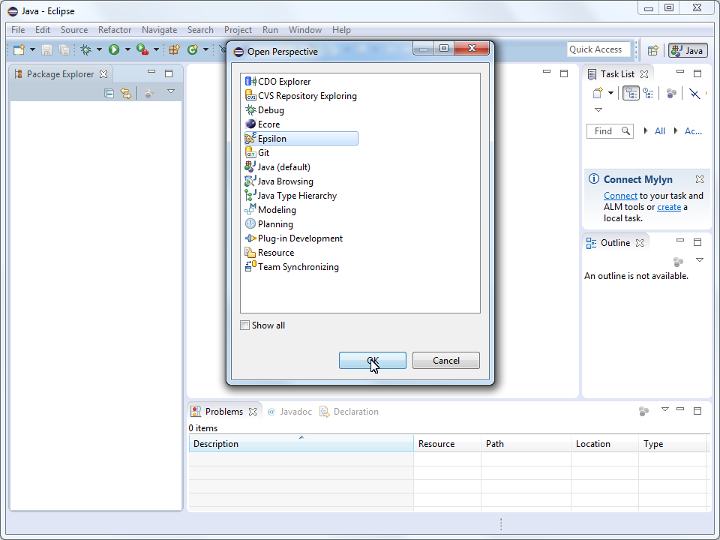

# Tools

- A ready-to-use Eclipse bundle with all required tools (EMF, Emfatic, Flexmi) pre-installed is available in the lab machines
- Once you have logged into Windows, search for `Epsilon 2.8` in the Start Menu
- When prompted to select the location of your Eclipse workspace, you **must** select a folder under the `H:` drive e.g. `H:/eng2-workspace`

> [!WARNING]
> Do **not** use backslashes in your workspace directory path under the `H:` drive as this is a network drive and there are issues with paths under network drives that we've brought to the attention of IT Services. As a workaround, please use forward slashes instead (i.e. `H:/eng2-workspace` instead of `H:\eng2-workspace`).
> 
> Also, when you launch Eclipse for the first time it may prompt you to place your workspace under a network path (e.g. `\\userfs\ab123\w2k\Desktop`) as shown below. If you select such a path instead of a path under the `H:` drive, you are likely to receive cryptic error messages later on.
>
> 

> [!TIP]
> As an alternative to the `H:` drive, you can place your workspace somewhere under the `C:` drive and use a GitHub/GitLab repo to store your work so that you can also access it from home.

- Close the `Welcome` view

- Open the `Epsilon` perspective

## Installing the ENG2 tools on your computer

- If you prefer to install the ENG2 tools in your computer, please follow the instructions under the `How to set up Eclipse in your computer for Part 2 (model-driven engineering)` page on VLE
- If you already have a copy of Eclipse installed in your computer, it will most likely **not** contain the tools you need for ENG2
