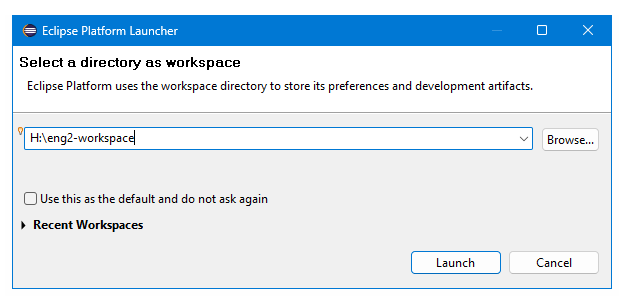
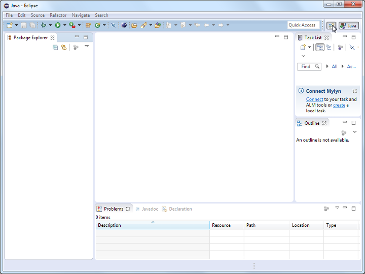

# Tools

- A ready-to-use Eclipse bundle with all required tools (EMF, Emfatic, Flexmi) pre-installed is available in the lab machines
- Once you have logged into Windows, search for `Epsilon 2.8` in the Start Menu
- When prompted to select the location of your Eclipse workspace, you **must** select a folder under the `H:` drive e.g. `H:\eng2-workspace`

<b>Network paths must be avoided!</b>

When you launch Eclipse for the first time it may prompt you to place your workspace under a network path (e.g. `\\userfs\ab123\w2k\Desktop`) as shown below. If you select such a path instead of a path under the `H:` drive, you are likely to receive cryptic error messages later on.

As an alternative to the `H:` drive, you can place your workspace somewhere under the `C:` drive, however, your files will then remain at the lab computer you are using and will not be synchronised with your profile (i.e. you will need to use the same computer next time to continue your work).

- Close the `Welcome` view

- Open the `Epsilon` perspective

## Installing the ENG2 tools on your computer

- If you prefer to install the ENG2 tools in your computer, please follow the instructions under the `Tools and Resources` category on VLE
- If you already have a copy of Eclipse installed in your computer, it will most likely **not** contain the tools you need for ENG2
