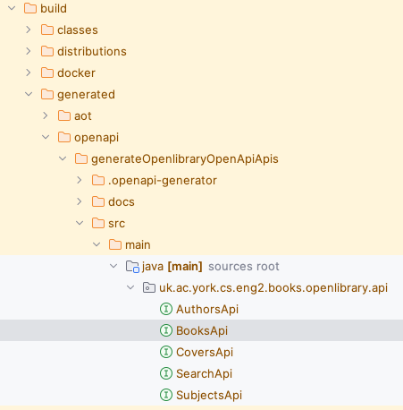

# Client generation

Before starting this section, you will need to have a solution to Practical 2.
You can use your own, or you can start from the [model solution of Practical 2](../../solutions/practical2.zip).

## Obtaining the OpenAPI specification

We want to integrate an external service to have better information about our books.
For this practical, we have chosen the [OpenLibrary API](https://openlibrary.org/developers/api), as they have an [OpenAPI sandbox](https://openlibrary.org/swagger/docs) that we can experiment with.

As a first step, visit their sandbox (see link above), and download the `openapi.json` file linked from under the "Open Library API" header:


Move and rename the `openapi.json` file to `src/main/openapi/openlibrary-0.1.0.json` in your project.

## Adding the Micronaut OpenAPI Gradle plugin

If we want to generate clients from the OpenLibrary OpenAPI spec, we will need to add the [Micronaut OpenAPI Gradle plugin](https://guides.micronaut.io/latest/micronaut-openapi-generator-client-gradle-java.html) to our `build.gradle`.

Open your `build.gradle` file, and add this line to the `plugins` section:

```groovy
id("io.micronaut.openapi") version "4.4.4"
```

Save the file and reload all Gradle projects as we did [at the end of the first section of Practical 2](../micronaut-data/02-libraries.md#ready-to-move-on).

If you did it correctly, the "Gradle" drawer in IntelliJ should show a new "Tasks - micronaut openapi" folder.

## Configuring the Micronaut OpenAPI Gradle plugin

We need to let the Micronaut OpenAPI Gradle know about the OpenLibrary spec.
Within the `micronaut` section of the `build.gradle` file, add this block:

```groovy
client("openlibrary", file("src/main/openapi/openlibrary-0.1.0.json")) {
    apiPackageName = "uk.ac.york.cs.eng2.books.openlibrary.api"
    modelPackageName = "uk.ac.york.cs.eng2.books.openlibrary.model"
    clientId = "openlibrary"
    useReactive = false
}
```

Reload all Gradle projects again, and try running the `build` Gradle task.
You will see that a number of classes ending in `Api` were generated for us within the `build/generated/openapi` folder:



## Specifying the base URL of the OpenLibrary API

You may notice that we specified a `clientId` in the `openapi` block.
This allows us to configure the generated client from the `application.properties` files.

Specifically, we'll need to tell Micronaut how to access the OpenLibrary API.
Edit the `src/main/resources/application.properties` file, and add these lines:

```
micronaut.http.services.openlibrary.url=https://openlibrary.org/api
```

## Examining the generated code

Have a look through the generated code. You may notice one oddity - the return types are all plain `Object`s, like this one from `BooksApi`:

```java
/**
 * {@summary Read Isbn}
 *
 * @param isbn (required)
 * @return Successful Response (status code 200)
 *         or Validation Error (status code 422)
 */
@Get("/isbn/{isbn}")
Object readIsbnIsbnIsbnGet(
    @PathVariable("isbn") @NotNull Object isbn
);
```

Unfortunately, it seems that at the moment the OpenAPI specification is manually written, and that they do not use schemas.
We will have to write additional logic in our gateway that understands the format of the response.
